- Components gràfics	
- Gestors d’esquema (Layout managers)	
  + FlowLayout	
  + BorderLayout	
  + GridLayout	
  + Nidació de panells	
- Gestió d’events d’usuari	
  + Classes anònimes	

_Bibliografia_

- The Java™ Tutorials - Creating a GUI With Swing: [https://docs.oracle.com/javase/tutorial/uiswing/TOC.html](https://docs.oracle.com/javase/tutorial/uiswing/TOC.html)
- The Java™ Tutorials - Using Swing Components: Examples
[https://docs.oracle.com/javase/tutorial/uiswing/examples/components/index.html](https://docs.oracle.com/javase/tutorial/uiswing/examples/components/index.html)

Java ofereix un conjunt de llibreries de classes molt completa per a la implementació d’interfìcies gràfiques d’usuari, que ens permetrà abandonar la consola de text i dotar a la nostra aplicació d’un _frontend_ amb els elements típics d’interacció gràfica mijantçant finestres, botons, icones, camps de text, etc.

L’**API de Swing** proporciona totes les eines per a construir GUI per a una gran diversitat d’aplicacions Java. És un API molt gran, a la vegada que poderosa i flexible. Dels seus 18 packages, per a la construcció d’una GUI, normalment farem servir dos:

- javax.swing
- javax.swing.event

La llibreria **Java Swing** conté els components gràfics que hem d’utilitzar, i aprendre a vincular, tant per a la **generació d’interfícies gràfiques d’usuari**, com per la **implementació de la seva lògica associada** per tractar les interaccions de l’usuari des del ratolí i el teclat.


#### Components gràfics
 
Cada component típic d’una interfície gràfica es troba representat per una classe de la llibreria Swing, i per tant, per cada component que vulguem afegir a la nostra interfície gràfica, haurem instanciar un objecte de la classe corresponent.

Els components Swing tenen la capacitat d’adaptar-se en aspecte i ús, a la plataforma en que siguin executades les aplicacions:

| Linux | Windows | MAC|
|---|---|---|
|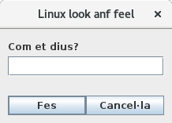|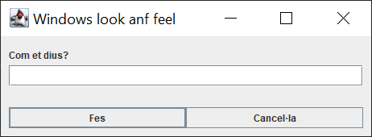|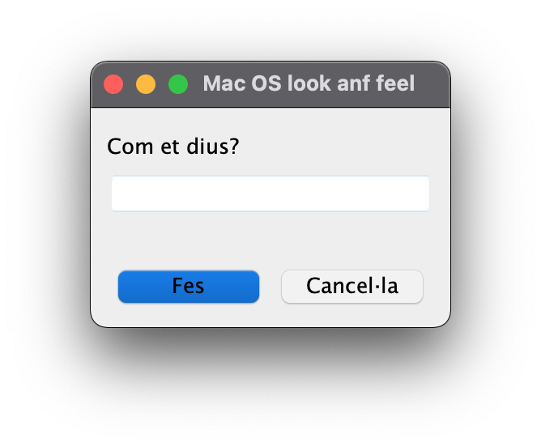|

El component **JFrame** és una finestra amb títol i cantonades ajustables.
Exemple de creació d’una finestra:

```java
import javax.swing.*;

public class Exemple1 {

   public static void main(String[] args){
       JFrame finestra = new JFrame("Títol de la finestra");
       
       finestra.setSize(300, 200);
       finestra.setVisible(true);

       //Per finalitzar l'aplicació en tancar la finestra
       finestra.setDefaultCloseOperation(JFrame.EXIT_ON_CLOSE);
   }

}
```
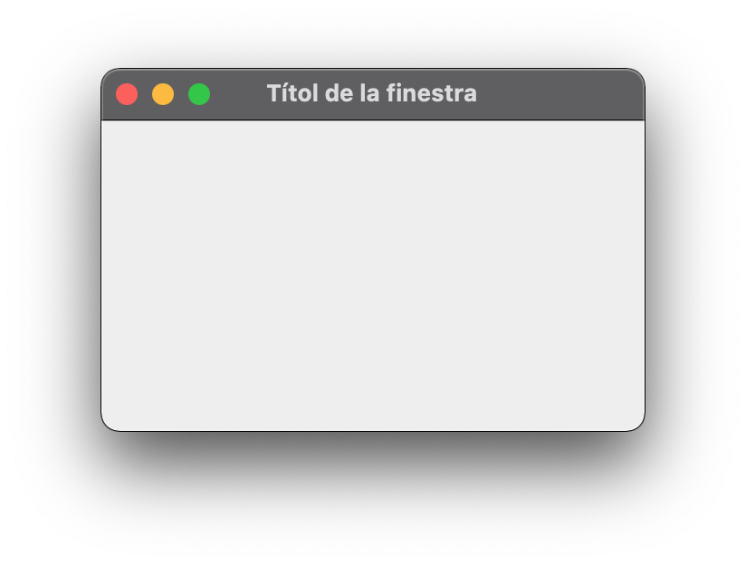


Swing compte amb una gran varietat de components, com **JLabel, JButton, JComboBox, JList, JTextField**, que hereten de **JComponent**.

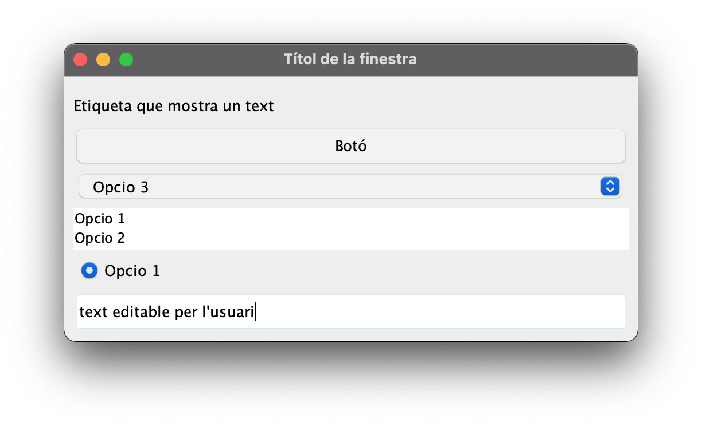
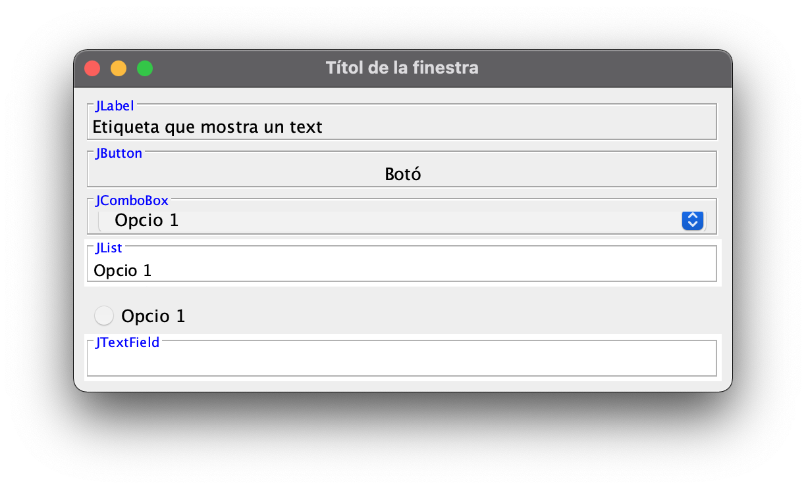


```java
import javax.swing.*;
import java.awt.*;

public class Exemple2 {

   public static void main(String[] args){

       JFrame finestra = new JFrame("Títol de la finestra");
        //Crear diferents components de Swing
       JLabel etiqueta = new JLabel("Etiqueta que mostra un text");
       JButton boto = new JButton("Botó");
       JComboBox llistaDesplegable = new JComboBox();
       llistaDesplegable.addItem("Opcio 1");
       llistaDesplegable.addItem("Opcio 2");
       llistaDesplegable.addItem("Opcio 3");
       JList llistatSeleccionable = new JList();
       String[] listData = {"Opcio 1", "Opcio 2"};
       llistatSeleccionable.setListData(listData);
       JRadioButton opcioMarcable1 = new JRadioButton("Opcio 1");
       JTextField campDeText = new JTextField();

       //Ficar els components a la finestra
       finestra.getContentPane().setLayout(new GridLayout(6, 1));
       finestra.getContentPane().add(etiqueta);
       finestra.getContentPane().add(boto);
       finestra.getContentPane().add(llistaDesplegable);
       finestra.getContentPane().add(llistatSeleccionable);
       finestra.getContentPane().add(opcioMarcable1);
       finestra.getContentPane().add(campDeText);

       //Afegir un marge al contingut de la finestra
       ((JPanel)finestra.getContentPane()).setBorder(BorderFactory.createEmptyBorder(8, 8, 8, 8));

       finestra.setSize(500, 260);
       finestra.setVisible(true);

       //Per finalitzar l'aplicació en tancar la finestra
       finestra.setDefaultCloseOperation(JFrame.EXIT_ON_CLOSE);
   }

}

```

#### Gestors d’esquema (Layout managers)

Els diferents components que conformen una finestra s’han d’incloure en components de tipus contenidors, en concret, de tipus **JPanel**. Els contenidors tenen associat un gestor d’esquema (**Layout manager**) que és el que determina la manera de distribuir els components dins el contenidor. Els Layout managers determinen la posició i la mida dels components del contenidor al que està associat.

A més, per a poder visualitzar un panell de la classe JPanel, s’ha d’associar a una finestra de la classe JFrame.

```java
//Ficar els components a la finestra
JPanel panell = new JPanel();
panell.setLayout(new GridLayout(6, 1));
panell.add(etiqueta);
panell.add(boto);
panell.add(llistaDesplegable);
panell.add(llistatSeleccionable);
panell.add(opcioMarcable1);
panell.add(campDeText);
finestra.setContentPane(panell);
```

O agafar el JPanel que ja té associat el JFrame.

```java
//Ficar els components a la finestra
finestra.getContentPane().setLayout(new GridLayout(6, 1));
finestra.getContentPane().add(etiqueta);
finestra.getContentPane().add(boto);
finestra.getContentPane().add(llistaDesplegable);
finestra.getContentPane().add(llistatSeleccionable);
finestra.getContentPane().add(opcioMarcable1);
finestra.getContentPane().add(campDeText);
```

Així, a un objecte de la classe JFrame, l’hem d’associar un objecte de la classe JPanel o usar el JPanel que ja té associat. A aquest objecte JPanel l’hem d’associar un objecte LayoutManager. Llavors, afegir els objectes tipus JComponent al JPanel.

Hi ha diversos tipus de Layout, mostrem alguns amb la seva distribució i exemples d’ús.

##### FlowLayout

Els gestor d’esquema FlowLayout distribueix els components un rere l’altre, d’esquerra a dreta i línia a línia. No modifica la mida dels components. Es pot especificar l'aliniament i espaiat entre components. Si el contenidor associat al FlowLayout és redimensiona, els components es redistribueixen.

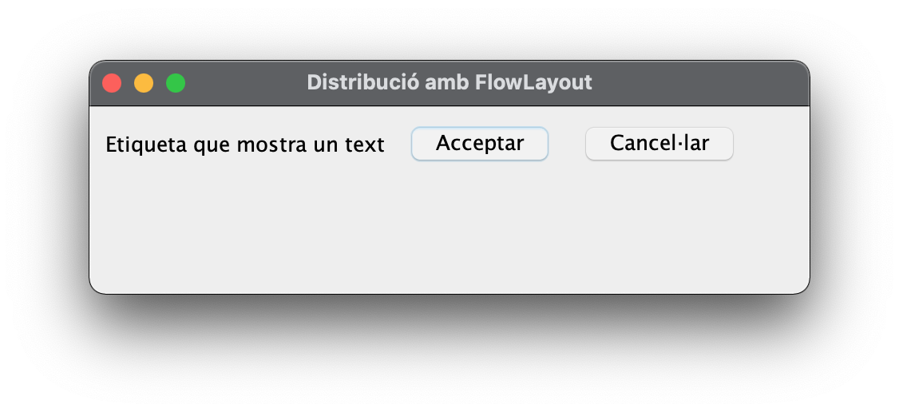

Canviant la mida de la finestra:
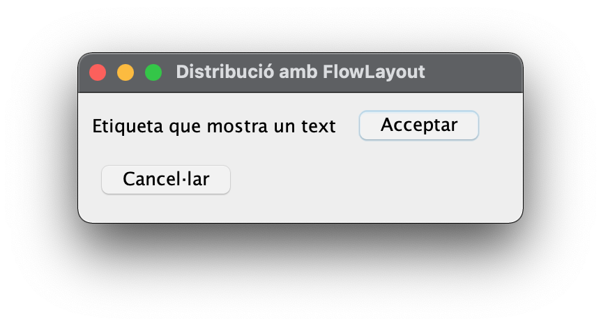

```java
import javax.swing.*;
import java.awt.*;

public class Exemple3 {

   public static void main(String[] args){

       JFrame finestra = new JFrame();

       JLabel etiqueta = new JLabel("Etiqueta que mostra un text");
       JButton boto1 = new JButton("Acceptar");
       JButton boto2 = new JButton("Cancel·lar");

       //Ficar els components a la finestra
       FlowLayout layout = new FlowLayout(FlowLayout.LEFT, 10, 10);
       finestra.getContentPane().setLayout(layout);
       finestra.getContentPane().add(etiqueta);
       finestra.getContentPane().add(boto1);
       finestra.getContentPane().add(boto2);

       String tipusDeLayout = finestra.getContentPane().getLayout().getClass().getSimpleName();
       finestra.setTitle("Distribució amb " + tipusDeLayout);

       //DibuixarLayouts.dibuixaComponents((JPanel) finestra.getContentPane());
       finestra.setSize(500, 260);
       finestra.setVisible(true);

       //Per finalitzar l'aplicació en tancar la finestra
       finestra.setDefaultCloseOperation(JFrame.EXIT_ON_CLOSE);
   }

}
```

##### BorderLayout

Els gestor d’esquema BorderLayout defineix 5 àrees diferents en el panell contenidor, que són _North, South, East, West i Center_. Modifica la mida dels components, fent que ocupin tota l’àrea en la que han sigut afegits. Si el contenidor associat al BorderLayout es redimensiona, els components canvien de mida. Les àrees buides (sense components) no es mostren, a excepció de l’àrea _Center_.

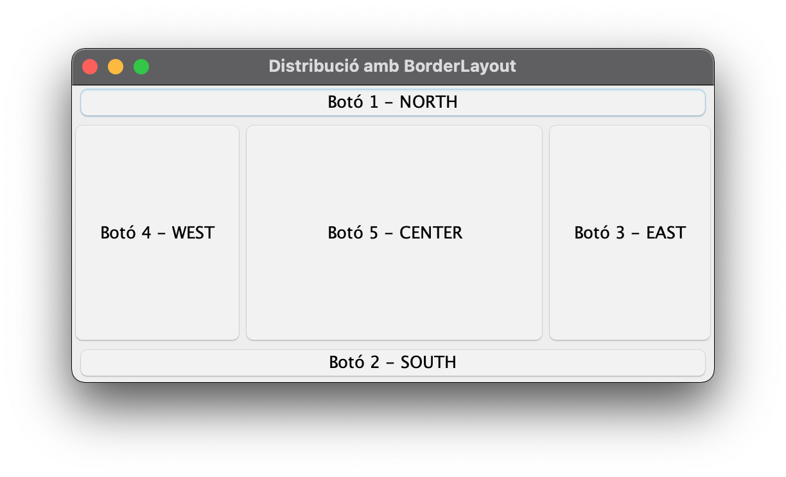

Canviant la mida de la finestra:
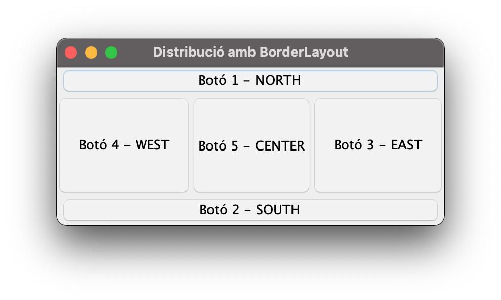

Amb àrees sense components afegits:
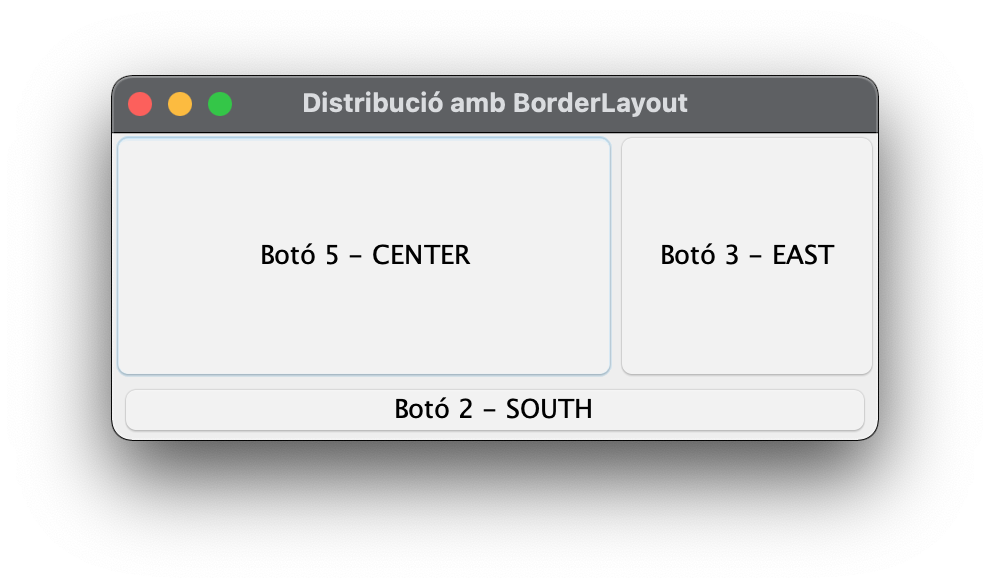


```java
import javax.swing.*;
import java.awt.*;

public class Exemple4 {

   public static void main(String[] args){

       JFrame finestra = new JFrame();

       JButton boto1 = new JButton("Botó 1 - NORTH");
       JButton boto2 = new JButton("Botó 2 - SOUTH");
       JButton boto3 = new JButton("Botó 3 - EAST");
       JButton boto4 = new JButton("Botó 4 - WEST");
       JButton boto5 = new JButton("Botó 5 - CENTER");

       //Ficar els components a la finestra
       BorderLayout layout = new BorderLayout();
       finestra.getContentPane().setLayout(layout);
       //finestra.getContentPane().add(boto1, BorderLayout.NORTH);
       finestra.getContentPane().add(boto2, BorderLayout.SOUTH);
       finestra.getContentPane().add(boto3, BorderLayout.EAST);
       //finestra.getContentPane().add(boto4, BorderLayout.WEST);
       finestra.getContentPane().add(boto5, BorderLayout.CENTER);

       String tipusDeLayout = finestra.getContentPane().getLayout().getClass().getSimpleName();
       finestra.setTitle("Distribució amb " + tipusDeLayout);

       //DibuixarLayouts.dibuixaComponents((JPanel) finestra.getContentPane());
       finestra.setSize(500, 260);
       finestra.setVisible(true);

       //Per finalitzar l'aplicació en tancar la finestra
       finestra.setDefaultCloseOperation(JFrame.EXIT_ON_CLOSE);
   }

}
```

##### GridLayout

Els gestor d’esquema GridLayout defineix un número de files i columnes i posa un component a cada cel·la. Totes les cel·les comparteixen la mateixa amplada i alçada. L’ordre dels components queda determinat per l’ordre en què s’afegeixen. Les cel·les s’omplen d’esquerra a dreta i de dalt a baix. Modifica la mida dels components, fent que ocupin tota l’àrea en la que han sigut afegits. Si el contenidor associat al GridLayout es redimensiona, els components canvien de mida.

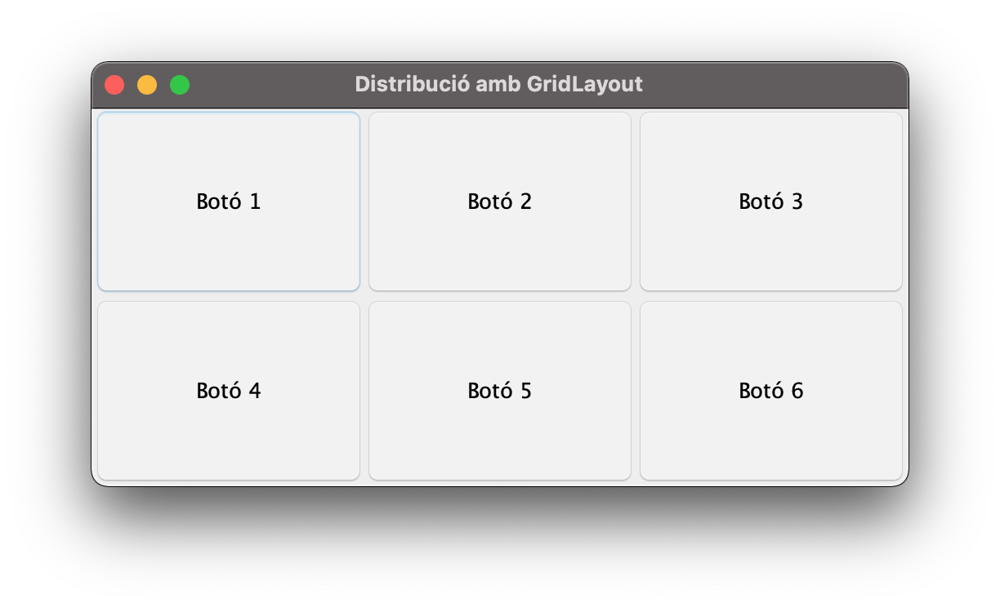

Canviant la mida de la finestra:
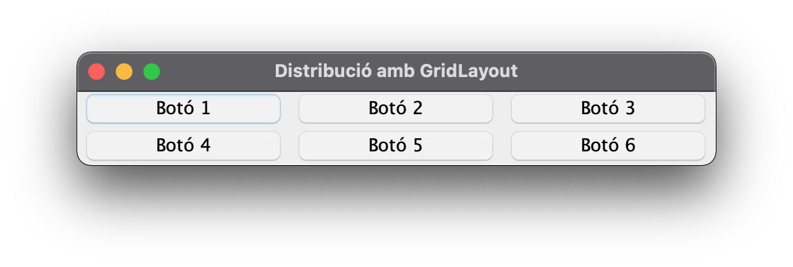

```java
import javax.swing.*;
import java.awt.*;

public class Exemple5 {

   public static void main(String[] args){

       JFrame finestra = new JFrame();

       JButton boto1 = new JButton("Botó 1");
       JButton boto2 = new JButton("Botó 2");
       JButton boto3 = new JButton("Botó 3");
       JButton boto4 = new JButton("Botó 4");
       JButton boto5 = new JButton("Botó 5");
       JButton boto6 = new JButton("Botó 6");

       //Ficar els components a la finestra
       GridLayout layout = new GridLayout(2, 3);
       finestra.getContentPane().setLayout(layout);
       finestra.getContentPane().add(boto1);
       finestra.getContentPane().add(boto2);
       finestra.getContentPane().add(boto3);
       finestra.getContentPane().add(boto4);
       finestra.getContentPane().add(boto5);
       finestra.getContentPane().add(boto6);

       String tipusDeLayout = finestra.getContentPane().getLayout().getClass().getSimpleName();
       finestra.setTitle("Distribució amb " + tipusDeLayout);

       finestra.setSize(500, 260);
       finestra.setVisible(true);

       //Per finalitzar l'aplicació en tancar la finestra
       finestra.setDefaultCloseOperation(JFrame.EXIT_ON_CLOSE);
   }

}
```

##### Nidació de panells

Per a la creació de GUI amb esquemes més complexes, el que hem de fer és **nidar panells que tinguin associats diferents gestors d’esquemes**. Un JPanel pot contenir una altre JPanel com un component més, que a la vegada, conté altres components.

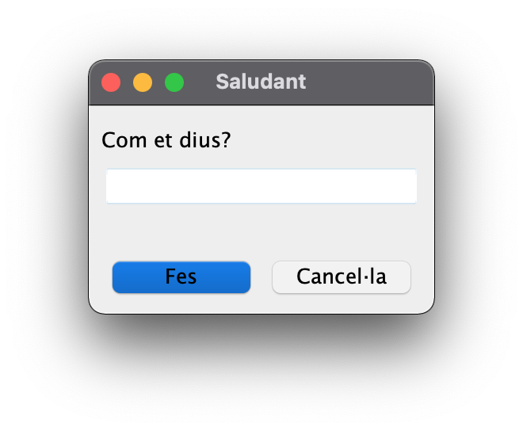
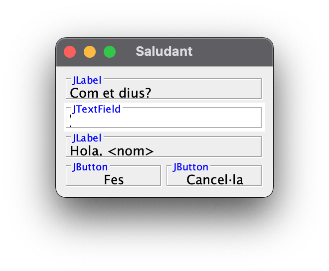
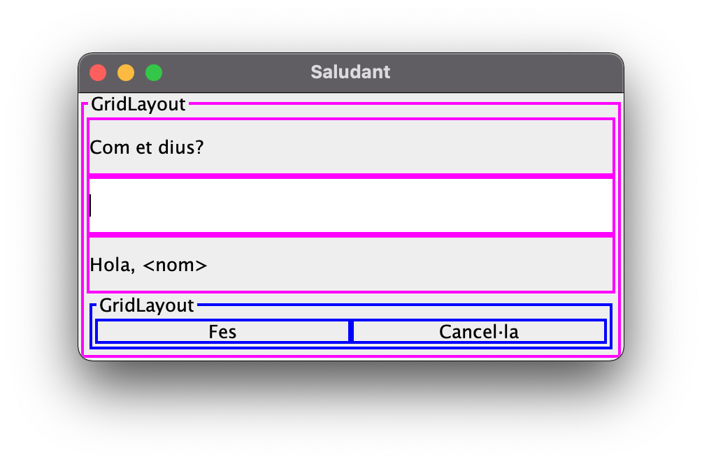

```java
import javax.swing.*;
import java.awt.*;
import java.awt.event.*;

public class FinestraSaluda extends JFrame {
   private JPanel contentPane;
   private final String CANCEL;
   private final String OK;
   private JButton buttonOK;
   private JButton buttonCancel;
   private JTextField textFieldResposta;
   private String pregunta;
   private final String TITOL;
   private JLabel labelPregunta;
   private JLabel labelResposta;
   private JPanel panelButton;

   public FinestraSaluda() {
       this.TITOL = "Saludant";
       this.setTitle(TITOL);

       this.pregunta = "Com et dius?";
       this.labelPregunta = new JLabel(pregunta);
       this.labelResposta = new JLabel();

       this.contentPane = new JPanel();

       this.CANCEL = "Cancel·la";
       this.OK = "Fes";
       this.buttonOK = new JButton(OK);
       this.buttonCancel = new JButton(CANCEL);

       this.textFieldResposta = new JTextField();
       contentPane.setLayout(new GridLayout(4,1));
       contentPane.add(labelPregunta);
       contentPane.add(textFieldResposta);
       contentPane.add(labelResposta);

       panelButton = new JPanel();
       panelButton.setLayout(new GridLayout(1, 2));
       panelButton.add(buttonOK);
       panelButton.add(buttonCancel);
       contentPane.add(panelButton);

       setContentPane(contentPane);

       contentPane.setBorder(BorderFactory.createEmptyBorder(8, 8, 8, 8));
       this.pack();

       Dimension dimension = Toolkit.getDefaultToolkit().getScreenSize();
       int x = (int) ((dimension.getWidth() - this.getWidth()) / 2);
       int y = (int) ((dimension.getHeight() - this.getHeight()) / 2);
       this.setLocation(x, y);

   }

   public static void main(String[] args) {
       FinestraSaluda frame = new FinestraSaluda();

       frame.setVisible(true);

   }
}
```

#### Gestió d'events d'usuari

Un **event** és la representació d’una acció de l’usuari, des del teclat o ratolí, per exemple, sobre la interfície gràfica. Els events són objectes que porten informació sobre les accions realitzades. Hi ha una gran varietat de classes d’events, per a representar les diferents categories d’accions d’usuari.

Un **_event source_** és el component on es genera l’event. Un **_event handler_** és l’objecte que rep la informació de l’event generat i el procesa. Els event handlers són **_listeners_** dels events generats en els components que els hagin registrat com a listeners.

Així, quan un usuari polsa un botó d’una GUI, si aquest botó té registrat un listener com a manegador d’aquest tipus d’event (pulsar sobre el botó), llavors es genera un objecte de tipus _ActionEvent_ amb el botó com a event source i amb informació relativa a l’event que s'acaba de generar. Per exemple, els objectes de la clase ActionEvent tenen el mètode _getActionCommand_ que retorna el nom de l’acció associada al botó.

Llavors, l’event de la classe ActionEvent arriba al listener que té registrat el botó. <u>Aquest listener és un objecte que ha d’implementar la interface _ActionListener_</u>. L’event arriba al listener com a paràmetre en l’execució del mètode _actionPerformed_, que Java el crida després de la creació de l’event.

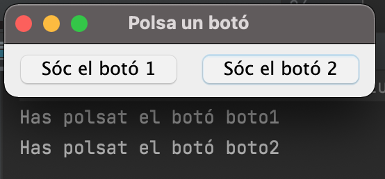

```java
import javax.swing.*;
import java.awt.*;

public class Exemple6 {

   public static void main(String args[]){
       JFrame finestra = new JFrame("Polsa un botó");

       finestra.getContentPane().setLayout(new FlowLayout(FlowLayout.CENTER));
       JButton boto1 = new JButton("Sóc el botó 1");
       boto1.setActionCommand("boto1");
       JButton boto2 = new JButton("Sóc el botó 2");
       boto2.setActionCommand("boto2");
       finestra.getContentPane().add(boto1);
       finestra.getContentPane().add(boto2);

       ButtonHandler buttonHandler = new ButtonHandler();
       boto1.addActionListener(buttonHandler);
       boto2.addActionListener(buttonHandler);

       finestra.pack(); //Calcula la mida adient segons els components
       finestra.setVisible(true);

       //Per finalitzar l'aplicació en tancar la finestra
       finestra.setDefaultCloseOperation(JFrame.EXIT_ON_CLOSE);
   }

}
```

```java
import java.awt.event.ActionEvent;
import java.awt.event.ActionListener;

public class ButtonHandler implements ActionListener {

   public void actionPerformed(ActionEvent e) {
       System.out.println("Has polsat el botó " + e.getActionCommand());
   }
}
```

Un component pot tenir tants manegadors (handlers) com sigui necessari, per exemple, per manegar diferents tipus d’event sobre el mateix component.

```java
ActionListener actionHandler;
…
boto.addActionListener(actionHandler);

MouseListener mouseHandler;
…
boto.addMouseListener(mouseHandler);
```

Un mateix manegador, por gestionar diferents tipus d’events, implementant les interfaces necessàries per a cada tipus de Listener a implementar.
```java
boto.addActionListener(buttonHandler);
boto.addMouseListener(buttonHandler);
```

Un mateix manegador, pot gestionar events sobre diversos components:
```java
boto1.addActionListener(buttonHandler);
boto2.addActionListener(buttonHandler);
```

Un mateix event pot ser gestionat per diferents manegadors. En aquestes cas, l’ordre de crida dels mètodes dels manegadors, és indefinit.
```java
boto.addActionListener(buttonHandler1);
boto.addActionListener(buttonHandler2);
```

En escriure codi per un event handler, hem d’implementar tots el mètodes de la interfície corresponent. Algunes interfícies tenen més d’un mètode i potser només ens interesa posar codi en un d’ells, però _implements_ ens obliga a implementar-los tots.

Per comoditat, per algunes interfícies Listener existeixen **_classes Adapter_** que implementen tots els seus mètodes però sense codi, així, podem fer un extends de la clase Adapter corresponent i sobreescriure només un dels seus mètodes, enlloc d’implementar la interfície _Listener_.

Taula amb els tipus d’events, listener i adapter corresponent, i mètodes a implementar.

|Event | Listener Interface | Adapter Class | Listener Methods|
|---|---|---|---|
|ActionEvent|ActionListener| |actionPerformed(ActionEvent)|
|KeyEvent|KeyListener|KeyAdapter|keyPressed(KeyEvent)<br>keyReleased(KeyEvent <br> keyTyped(KeyEvent)|
|ListSelectionEvent|ListSelectionListener| |valueChanged(ListSelectionEvent)|
|MouseEvent|MouseListener|MouseAdapter|mouseClicked(MouseEvent)<br>mouseEntered(MouseEvent)<br>mouseExited(MouseEvent)<br>mousePressed(MouseEvent)<br>mouseReleased(MouseEvent)|
|MouseEvent|MouseMotionListener|MouseMotionAdapter|mouseDragged(MouseEvent)<br>mouseMoved(MouseEvent)|
|  |WindowListener|WindowAdapter|windowActivated(WindowEvent)<br>windowClosed(WindowEvent)<br>windowClosing(WindowEvent)<br>windowDeactivated(WindowEvent)<br>windowDeiconified(WindowEvent)<br>windowIconified(WindowEvent)<br>windowOpened(WindowEvent)|

Taula completa a [https://docs.oracle.com/javase/tutorial/uiswing/events/api.html](https://docs.oracle.com/javase/tutorial/uiswing/events/api.html)

Taula de components Swing i els tipus d’events que poden manegar a [https://docs.oracle.com/javase/tutorial/uiswing/events/eventsandcomponents.html](https://docs.oracle.com/javase/tutorial/uiswing/events/eventsandcomponents.html)

_Exemple més complex:_

Programa que indica si el ratolí és sobre un botó o si surt d’ell, canviant també de color del missatge.Posa en negreta el missatge clicant a sobre d’ell i el deixar sense negreta tornant a clicar. Mostra en el missatge, allò escrit en el camp de text només entrar en el camp i mentre escrivim en ell.

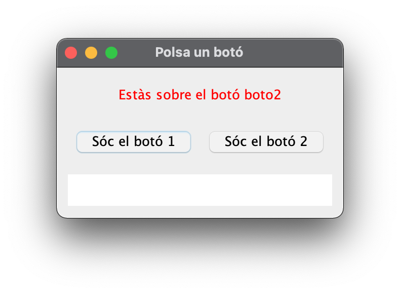

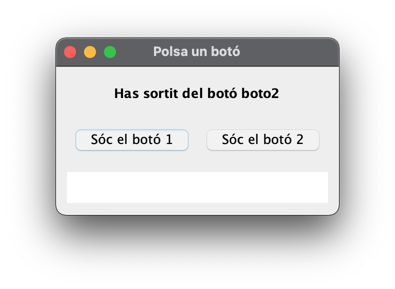
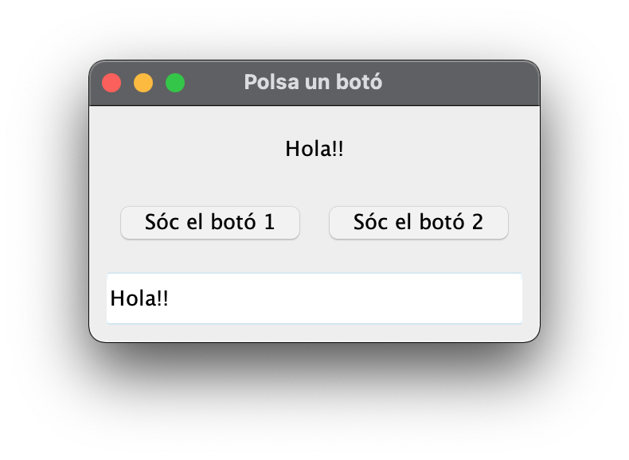


Components de la GUI:
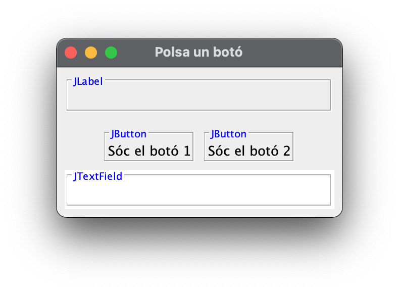

Layouts manager de la GUI:
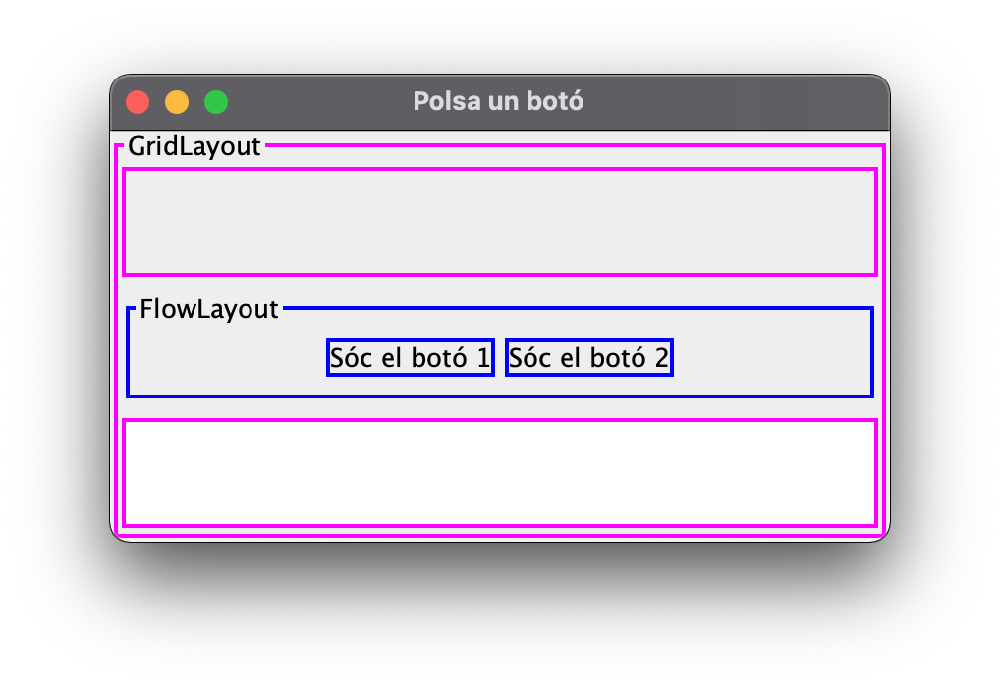

```java
import javax.swing.*;
import java.awt.*;
import java.awt.event.*;

public class Exemple7 extends MouseAdapter implements ActionListener, KeyListener {
   private JFrame finestra;
   private JLabel labelMostraText;
   private boolean negreta;
   private JTextField textField;

   public Exemple7(){
       finestra = new JFrame("Polsa un botó");

       finestra.getContentPane().setLayout(new GridLayout(3, 1, 8, 8));
       labelMostraText = new JLabel();
       labelMostraText.setHorizontalAlignment(JLabel.CENTER);
       finestra.getContentPane().add(labelMostraText);

       JPanel buttonPanel = new JPanel();
       buttonPanel.setLayout(new FlowLayout(FlowLayout.CENTER));
       JButton boto1 = new JButton("Sóc el botó 1");
       boto1.setActionCommand("boto1");
       JButton boto2 = new JButton("Sóc el botó 2");
       boto2.setActionCommand("boto2");
       buttonPanel.add(boto1);
       buttonPanel.add(boto2);
       finestra.getContentPane().add(buttonPanel);

       textField = new JTextField();
       finestra.getContentPane().add(textField);

       //Registrar els manegadors dels events de polsar els botons
       boto1.addActionListener(this);
       boto2.addActionListener(this);
       boto1.addMouseListener(this);
       boto2.addMouseListener(this);
       labelMostraText.addMouseListener(this);
       textField.addKeyListener(this);
       textField.addMouseListener(this);

       //Afegir un marge al contingut de la finestra
       ((JPanel)finestra.getContentPane()).setBorder(BorderFactory.createEmptyBorder(8, 8, 8, 8));

       finestra.pack(); //Calcula la mida adient segons els components

       //Per finalitzar l'aplicació en tancar la finestra
       finestra.setDefaultCloseOperation(JFrame.EXIT_ON_CLOSE);
   }

   public void setVisible(boolean visible){
       finestra.setVisible(visible);
   }

   public void actionPerformed(ActionEvent e) {
       String missatge = "Has polsat el botó " + e.getActionCommand();
       this.labelMostraText.setForeground(Color.BLUE);
       this.labelMostraText.setText(missatge);
   }

   public void mouseEntered(MouseEvent e) {
       if (e.getSource() instanceof JButton) {
           JButton botoPolsat = (JButton) e.getSource();
           String missatge = "Estàs sobre el botó " + botoPolsat.getActionCommand();
           this.labelMostraText.setForeground(Color.RED);
           this.labelMostraText.setText(missatge);
       }
   }

   public void mouseExited(MouseEvent e){
       if (e.getSource() instanceof JButton) {
           JButton botoPolsat = (JButton) e.getSource();
           String missatge = "Has sortit del botó " + botoPolsat.getActionCommand();
           this.labelMostraText.setForeground(Color.BLACK);
           this.labelMostraText.setText(missatge);
       }
   }

   public void mouseClicked(MouseEvent e){
       if (e.getSource() instanceof JLabel) {
           if(this.negreta){
               this.labelMostraText.setFont(this.labelMostraText.getFont().deriveFont(Font.PLAIN));
           }else {
               this.labelMostraText.setFont(this.labelMostraText.getFont().deriveFont(Font.BOLD));
           }
           this.negreta = !this.negreta;
       }else if (e.getSource() instanceof JTextField){
           onEscriu();
       }
   }

   public void keyTyped(KeyEvent e) {
       onEscriu();
   }

   public void keyPressed(KeyEvent e) {
       onEscriu();
   }

   public void keyReleased(KeyEvent e) {
       onEscriu();
   }

   private void onEscriu(){
       this.labelMostraText.setText(this.textField.getText());
   }

   public static void main(String args[]){
       Exemple7 exemple = new Exemple7();
       exemple.setVisible(true);
   }
}
```

#### Classes anònimes

{}
Una manera molt pràctica per a implementar la gestió d’events a Swing és l’ús de classes anònimes. **Una classe anònima és una expressió que defineix una classe i a la vegada crea una instància (objecte)**.
{}

```java
ExistingClassOrInterface e = new ExistingClassOrInterface() {
            //Definir atributs i mètodes
            public void method() {
                //Codi del mètode
            }
        …
        };
```
##### Exemple:

Programa que mostra un botó i en clicar sobre ell mostra un missatge, que s’esborra si tornem a clicar sobre el botó.
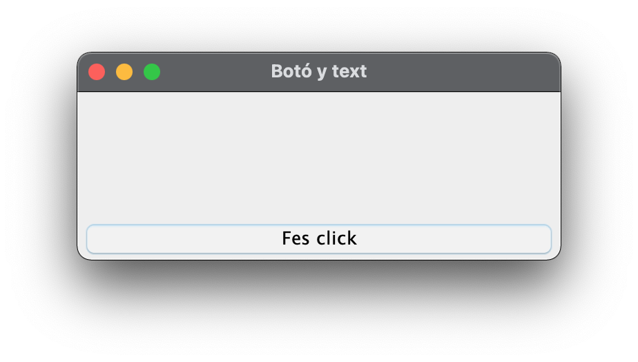
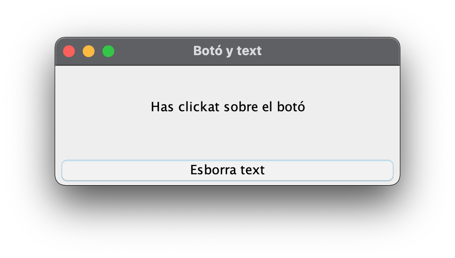

```java
import javax.swing.*;
import java.awt.*;
import java.awt.event.ActionEvent;
import java.awt.event.ActionListener;

public class Exemple8 {

   public static void main(String args[]){
       JFrame finestra = new JFrame("Botó y text");

       finestra.getContentPane().setLayout(new BorderLayout(8, 8));

       JLabel text = new JLabel();
       text.setHorizontalAlignment(JLabel.CENTER);
       finestra.getContentPane().add(text, BorderLayout.CENTER);

       String titolBoto = "Fes click";
       JButton boto = new JButton(titolBoto);
       finestra.getContentPane().add(boto, BorderLayout.SOUTH);

       boto.addActionListener(new ActionListener() {
           @Override
           public void actionPerformed(ActionEvent e) {
               if("".equals(text.getText())){
                   text.setText("Has clickat sobre el botó");
                   boto.setText("Esborra text");
               }else{
                   text.setText("");
                   boto.setText(titolBoto);
               }
           }
       });

       finestra.setSize(350, 150);
       finestra.setVisible(true);

       //Per finalitzar l'aplicació en tancar la finestra
       finestra.setDefaultCloseOperation(JFrame.EXIT_ON_CLOSE);
   }

}
```
