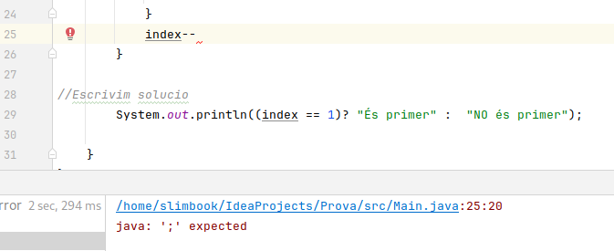
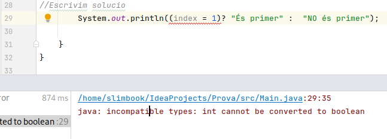
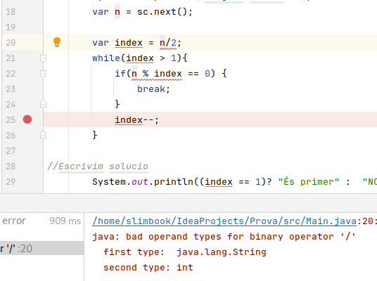
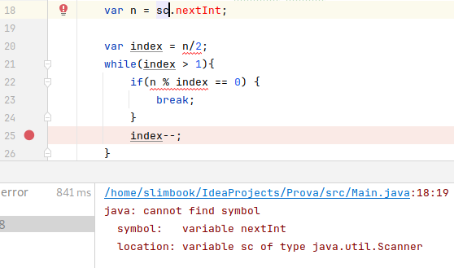
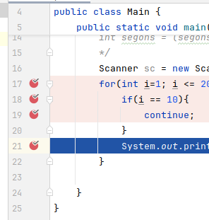

#### Depuració de codi

La depuració de codi ens ajudarà a corregir el nostre codi per tal que tingui el comportament que n'esperem. Normalment cal classificar dues problemàtiques diferents: existeixen error en la compilació, o no existeixen errors en la compilació però el resultat esperat no és el que hauria de ser.

#### Errors de compilació
Els errors venen perquè un cop compilem el codi, aquest té errors sintàtics i/o semàntics que no permeten crear el .class a partir del qual executem. Quan això passa veurem imprès per línia de comandes quin tipus d'error tinc i en quina línia és detectat. És necessari entendre molt bé els tipus d'error més comuns per tal de saber on està la solució al problema. Cal aprendre a llegir errors i a documentar-se sobre els errors, són molt variats i de moltes tipologies diferents, tot seguit, un recull dels més comuns al principi:

##### Errors típics

> En aquest cas apreciem que la instrucció index-- li falta ";" de finalització. En l'error ens   indica la línia 25, i el caràcter 20 des de l'inici de la línia. 


---

> El següent error ens indica que l'operador relacional de comparació d'iguals és el "==", no el "=" com hem posat. En Java "=" és l'assignació d'una valor a una variable, mentre que "==" realitza la comparació entre dues variables del mateix tipus. Per això el que passa dins l'expressió index = 1 és que s'assigna el valor 1 a index i després no es troba un valor booleà necessari per avaluar la condició.


---

> L'error en aquest cas es deu a que a la variable var n se li assigna un String ja que la lectura prové de sc.next(); Per tant no és un enter com es demana alhora de realitzar la divisió a la següent instrucció.


---
 
> Aquest error es deu a que falta "()" a la funció sc.nextInt. Sense "()" no es detecta que és una funció de lectura d'enters de la classe Scanner com s'indica en l'error.



#### El resultat no és l'esperat.

En aquests casos és necessari aprendre a depurar bé el codi ja que necessitem entedre en quin punt de l'execució divergeix del que teníem planificat. Per tal de depurar el codi existeixen diferents tècniques.

1. **"System.out.println".**
Aquesta tècnica s'aplica, sobretot, en codis senzills o curts, que no necessitin de molta infraestructura. Consisteix en observar el valor de certes variables en certs punts per descobrir si:
  - El programa arriba a entrar en aquell punt i per tant s'observa el que s'imprimeix. (Si no és així cal investigar anteriorment quin és el camí que segueix fins on hauria hagut d'arribar)
  - Les variables tenen els valors esperats en aquell/s punt/s concret/s.

2. **Breakpoint - debugger de Intellij Idea**
Una eina més potent és la que ens ofereix el propi IDE de desenvolupament. Consisteix en determinar punts exactes del nostre codi i parar l'execució de forma intermitent per comprovar **TOTS els valors de totes les variables** que es guarden en memòria, això ens ajuda a descobrir si en un determinat punt el comportament que s'espera del programa és l'esperat.

Mitjançant aquesta tècnica es permet determinar tants punts com volguem en l'execució del codi. Quan s'arriba a aquests punts el programa es queda en un estat latent, i ens permet a nosaltres, avançar instrucció a instrucció, o bé avançar fins al següent breakpoint que tinguem definit. Per exemple, si tenim un bucle i posem un sol breakpoint en el bloc on s'itera, permetrà en cada iteració visualitzar el valor de les variables que es van modificant.

Per tal d'utilitzar aquesta tècnica cal que:
1.  Marquem aquelles línies on volem aturar l'execució, això ho realitzem marcant la rodoneta vermella que ens apareix al costat de cada instrucció on volem realitzar una parada.



2. A continuació anem a executar el fil del codi com a debugger, és l'element de color verd que tenim al costat del triangle verd:


3. El que farà el codi a continuació és continuar la seva execució normal fins que trobi la instrucció que hem fixat amb el breakpoint. En aquest punt, s'aturarà l'execució i permetrà veure els valors que tenen les variables fins al moment (imatge inferior). El següent pas és determinar si el comportament és l'esperat i a partir d'aquí podem anar al següent breakpoint (Mayus + F8 - step out) o executar el codi línia a línia (F7 -  step into), dependrà del que ens interessi. 


#### Assercions

Les assercions en Java serveixen per comprovar que els blocs de codi que estem implementant estan donant els resultats esperats a partir d'una sèrie de tests que implementem. Existeixen llibreries molt complertes pel maneig d'assercions en Java: JUnit, Mockito, Selenium, etc. 

No és objecte d'aquesta primera part configurar una d'aquestes llibreries, senzillament ensenyem com configurar en Intellij Idea l'habilitació d'assercions i comprovar com utilitzar-les.

Per fer-ho, cal que:
1. Aneu al menú superior, en Run->Edit Configurations. 
2. En Modify Options afegiu VM options com a paràmetre dels elements de configuració de l'execució del programa. 
3. En aquest camp cal que hi poseu -ea (Enable Assertions), per defecte estan "disabled" i per tant encara que escrivíssim `asserts` no en veuríem el resultat. 
4. Un cop heu escrit -ea cal que li doneu a Apply.

Ara sí ja podem escriure `asserts` en el nostre codi. 

Els asserts ens són útils per comprovar els valors que prenen les nostres variables i llançar excepcions quan no compleixen amb els nostres requisits o valors esperats.

Per exemple, retornant a l'exemple de les notes que havíem fet durant l'estructura de selecció, aplicarem un assert quan la nota introduïda no estigui continguda entre 0 i 10.

```java
Scanner sc = new Scanner(System.in);
var nota = sc.nextInt();                         

assert nota >= 0 && nota <= 10 : "La nota ha d'estar entre 0 i 10";

if (nota < 5) {
    System.out.println("Suspès");                
else if (nota < 6) {
    System.out.println("Aprovat");               
}
else if (nota < 8) {
    System.out.println("Bé");                    
}
else if (nota < 9) {
    System.out.println("Notable");               
}
else{
    System.out.println("Excel·lent");            
}
```

Com s'observa, si la nota no està entre 0 i 10 el programa llançarà una excepció on s'indica que s'espera una nota entre 0 i 10.
