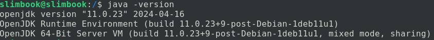
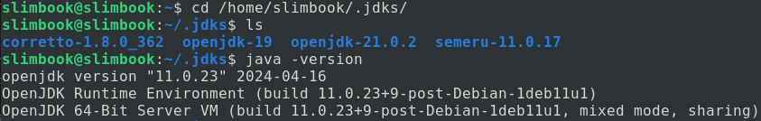

#### Cas particular de Java

Tot seguit veiem què passa amb un programa qualsevol, per exemple `HolaMon.java` escrit en Java. És el primer programa que s'acostuma a mostrar de qualsevol llenguatge de programació. La única funció que té aquest programa és escriure per pantalla un text que digui "Hola Món". 

Si us fixeu en la següent il·lustració es mostra tot el procés de compilació. Inicialment tenim el codi font del fitxer HolaMundo.java escrit pel programador. El següent pas és transformar aquest fitxer pla en un fitxer binari que entengui la màquina (bytecode), cada plataforma genera el seu propi fitxer `.class` diferent. La creació d'aquest fitxer binari ens assegura que el procés de compilació del fitxer .java s'ha executat correctament, en java s'utilitza la comanda javac per poder obtenir-lo.
`javac HolaMundo.java` Amb aquesta instrucció "es compila" el programa i genera un HolaMundo.class.

Un cop tenim el fitxer .class, executant la comanda `java HolaMundo` obtenim l'execució del nostre programa sobre la plataforma on estiguem, per això en la imatge següent el codi màquina que s'executa amb Win32 serà diferent que el que interpreta MacOS ja que són SO's diferents que obeeixen a instruccions diferents i per tant amb .class diferents.

En el següent exemple es pot veure com seria un fitxer .java que es llegeix i s'enten amb llenguatge humà. A continuació, en el procés de compilació, es genera el fitxer .class, aquí ja els humans no entenem el contingut del fitxer ja que està en hexadecimal, i finalment quan executem el programa es genera un fitxer en codi màquina amb una tira de 0s i 1s que són les instruccions que necessita la CPU en cada plataforma per ser executat. Aquest últim fitxer serà diferent en cada plataforma d'execució (Linux, Windows, MacOS...)

#### Evolució de Java

El llenguatge  de programació Java va ser desenvolupat per [James Gosling](https://ca.wikipedia.org/wiki/James_Gosling) l'any 1991. La primera versió va ser publicada per [Sun Microsystems](https://ca.wikipedia.org/wiki/Sun_Microsystems) l'any 1995, a partir de la versió JDK 1.0.2 va passar a anomenar-se Java, l'any 1996.

Com observareu en el següent link [Versions de Java](https://en.wikipedia.org/wiki/Java_version_history), les versions de Java estan en constant evolució afegint en cada nova versió noves funcionalitats que modernitzen i actualitzen el llenguatge als nous reptes que van sorgint.

Si us fixeu en les dates de noves versions, veureu que fins a la versió de Java SE 9 s'anaven creant versions cada 2 i cada 3 anys, a partir de Java SE 9 les versions són semestrals. És així ja que des de l'any 2017 s'ha accelerat el disseny de software i la innovació en el món de la programació ha fet que sorgeixin en períodes curts de temps noves funcionalitats, de manera que l'equip de desenvolupadors de Java van creure necessari traure versions de Java cada 6 mesos. 

De les diferents versions cal destacar aquelles que tenen un suport en el manteniment d'errades i actualització de sistema d'aquelles versions que no tenen aquest suport, així doncs observareu que Java SE 8, Java SE 11, Java SE 17, Java SE 21 tenen d'aquest suport que permet una estabilitat alhora d'implantar sistemes que utilitzin aquestes versions.

En el llistat de cada versió també podeu veure quines són les noves *"features"* o funcionalitats que incorporen les noves versions respecte a les anteriors.

Durant el curs utilitzarem la última versió estable i, que per tant gaudeix d'aquest manteniment, és la versió de **Java SE 21**.

En el següent gràfic podeu veure el nombre de noves JEP's (JDK Enhancement Proposals) que s'han afegit en cada nova versió de Java. (Font de: https://dev.java/evolution/)

#### Versió de Java   

Per saber quina versió teniu instal·lada en el vostre sistema heu d'anar al terminal i en la línea de comandes podeu escriure `java -version`. Veureu:   
    

Tot hi així com que treballarem dins un programa per escriure codi, un IDE (Integrated Development Environment), permetrà instal·lar per a cada projecte que volguem la versió que volguem de Java, per defecte tindrem la Java SE 21. El programa per escriure codi que utilitzem és **IntelliJ Idea**.

A mesura que aneu fent projectes i instal·leu versions diferents de Java, a partir d'ara JDK (Java Development Kid), veureu que si aneu a la carpeta `home/usuari/.jdks` us apareixen totes les versions que teniu disponibles (a part de la del propi sistema), ja que les heu utilitzades en algun projecte anterior.

 

#### JDK i JRE  

Fins ara hem parlat del llenguatge de programació Java però no hem explicat la seva estructura interna, com s'organitza per paquets i mòduls. La següent imatge resumeix la seva organització:

 

**JDK és el Java Development Kit.** És el mòdul més genèric que ens podem instal·lar i disposa de les eines per `construir programes` usant el llenguatge de programació Java. Com veieu en la imatge, entre les eines més importants hi ha el compilador (javac), el desassemblador de binaris (javap), el debugger, jar, javadoc, Web Services,... ** Una instal·lació de JDK ja conté dins el JRE.**

**JRE és el Java Runtime Environment**. Conté la JVM (Java Virtual Machine) i altres eines que permeten `l'execució` i de les aplicacions fetes en Java. el JRE no posseeix compiladors ni eines per desenvolupar aplicacions de Java, només conté eines d'execució de programes Java.

En la següent web teniu diferents versions del JDK que us podeu instal·lar a la vostra màquina depenent del sistema operatiu i la versió que tingueu: [Java Oracle JDK](https://www.oracle.com/java/technologies/downloads/)
