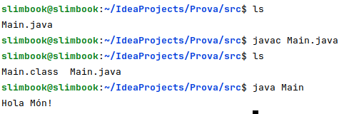
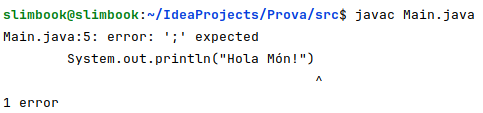

#### Primer programa

```java
public class Main {

    public static void main(String[] args) {

        System.out.println("Hello world!");
        
    }
}
```

En qualsevol llenguatge de programació, el primer programa que es veu és l'Hola Mon, aquest programa l'únic que fa és imprimir per pantalla un missatge, en aquest cas "Hello world!".

Tot el codi que escrivim estarà encapsulat dins una classe Main `public class Main`, i dins una funció main `public static void main(String []args)`. Les instruccions que escrivim han d'anar contingudes dins els caràcters **{ }** de la funció.

En aquest cas, una manera senzilla d'escriure per pantalla un text és utilitzant la instrucció: `System.out.println("Hello world!");` Tot el que estigui contingut dins **""** serà el text que es veurà per pantalla. Java tracta el tipus de text com a cadena de caràcters tot el que vagi contingut entre "".

Quan executem un programa de Java, el que farà la màquina virtual de Java, la JVM, és buscar una funció que es digui `public static void main(String []args)` i començarà a executar totes les instruccions que estiguin dins.

Si ara volguéssim executar aquest programa el guardaríem en un fitxer que s'anomeni **IGUAL** que el nom de la classe, en el nostre exemple s'ha de dir Main.java. L'extensió dels fitxers font que escriurem han d'acabar en `.java`.

A continuació en la línea de comandes realitzarem la compilació del programa utilitzant l'eina del JDK **javac**. En el procés de compilació s'analitza que el nostre programa compleix amb les regles sintàctiques i semàntiques d'acord amb el llenguatge Java, si hi hagués algun error s'informaria del mateix per línea de comandes. Si tot ha anat bé s'ha generat un Main.class (L'objecte de bytecode generat amb el nostre sistema).Aquest és el document binari que Java pot utilitzar usant l'eina del JDK **java**.

|Procés de compilació i execució:|
| --- |
|  |

|En el següent exemple m'he deixat el ";" final de l'expressió i apareix el següent error al compilar:|
| --- |
|   |

