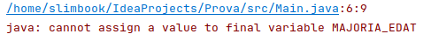

En el següent capítol parlarem de quin tipus de dades tenim en Java, què són les variables, els identificadors, els literals i les constants.


#### Tipus de dades

En el llenguatge Java incorpora tipus de dades diferents d'acord amb la seva naturalesa: no és el mateix un nombre, que un text o un valor verdader/fals per exemple. Aquests tipus de dades els classifiquem en tipus de dades primitius i tipus de dades de classe:
- **Primitius**: són les dades simples que coneixem com a nombres, text, etc. i que ens defineix de forma primitiva el llenguatge.
- **Classe**: són tipus de dades més complexos que es creen a partir dels mateixos tipus de classe o de tipus primitius.

#### Tipus Primitius

En Java podem diferenciar els següents tipus de dades primitius:

* Numèrics:
  * Enters: byte, short, int i long
  * Reals: float, double 
* Textuals:
  * chars
* Lògics:
  * boolean

La diferència entre els nombres enters i reals és que els nombres enters no contenen decimals (ex: 2 | 3 | 25) i els nombres reals reserven espai pels decimals (ex: 4,45 | 6,82 | 3,141592). Tot seguit es mostra una taula de rangs:

| Nom | Longitud | Rangs de valors |
| --- | --- | --- |
| byte | 8 bits	| De -2<sup>7</sup> a 2<sup>7</sup> -1 |
| short | 16 bits | De -2<sup>15</sup> a 2<sup>15</sup> -1 |
| int | 32 bits | De -2<sup>31</sup> a 2<sup>31</sup> -1 |
| long | 64 bits | De -2<sup>63</sup> a 2<sup>63</sup> -1 |
|float | 32 bits |
|double | 64 bits |
| char | 16 bits |

Els valors que admet una variable de tipus booleà és: true o false. Un valor booleà és molt comú en el camp informàtic on moltes vegades cal prendre una decisió que es pot avaluar en "veritat" o "fals".


#### Variables

Les variables són posicions de memòria que ocupen uns determinats bits (depèn de cada variable, taula anterior) i que ens ajuden a guardar la informació que té incidència en el nostre programa. Normalment existeix una `declaració` de variable que consisteix en declarar un `tipus nomVariable`. En ella indiquem a un nom de variable de **QUIN TIPUS** és, i tot seguit li podem assignar un valor d'aquell tipus concret.


##### Exemple d'assignació de valors

Declarem i assignem un valor a les variables:
```java
boolean valorBoolea = true;
int valorEnter = 50;
float valorDecimal = 50.3f;
char lletra ='v';
```

En aquest cas primer declarem les variables i després li assignem un valor:
```java 
boolean valorBoolea; 
valorBoolea = true;

int valorEnter;
valorEnter = 50;

float valorDecimal;
valorDecimal = 50.3;

char lletra;
lletra ='v';
```

La **declaració de variable** li serveix a Java per reservar un espai en memòria diferent per cada tipus declarat, per exemple no és el mateix declarar un `float variable` que un `double variable`, malgrat que els dos casos tinguem un nombre real la primera declaració ocupa 32 bits, mentre que la segona ocupa en memòria 64 bits.


Una vegada la variable ha estat declarada li assignem el valor en l'espai de memòria reservat. Per cada tipus diferent li assignarem un valor o un altre.

#### Identificadors

Els identificadors són els noms que donem a les variables. D'acord amb el [Naming Conventions](https://www.oracle.com/java/technologies/javase/codeconventions-namingconventions.html) els identificadors segueixen el sistema upperCamelCase, on la primera paraula és tot en minúscules i si hi ha més paraules, la primera lletra passa a ser majúscula. Això afavoreix la llegibilitat de les variables.

```java
int variable;
int variableExtensa;
int variablesMoltMesLlarga;
``` 

##### Paraules reservades

Existeixen un conjunt de paraules reservades del propi llenguatge Java i que no estan permeses utilitzar com a noms de variable. A part de (null, true, false que tampoc):

* abstract, default, if, private, this, boolean, do, implements, protected, throw
* break, 	double,	import, public, throws, byte, else, instanceof, return, transient,
* case, extends, int, short, try, catch, final, interface, static, void, char,
* finally, long, volatile, class, float, native, super, while, for, new, switch, 	 
* continue, package, synchronized

#### Literals

Un literal és un valor constant format per una seqüència de caràcters. Són exemples de literals els nombres, els caràcters i les cadenes de caràcters. Ex:

```java
700     //literal int
700.12  //literal double
700L    //literal long
700.12F //literal float
true    //literal boolean
'c'     //literal char
"Casa"  //literal String


int variableInt = 700;              //per defecte, quan és un valor enter és de tipus INT
double variableDouble = 700.12;     //per defecte, quan és un valor amb decimal és de tipus DOUBLE
long variableLong = 700L;           //també podem posar 700l
float variableFloat = 700.12F;      //també podem posar 700.12f
boolean variableBoolea = true;
char variableCaracter = 'c';
String variableString = "Casa";
``` 


#### Constants

Una constant és una variable que només es pot inicialitzar (modificar el valor al principi), i després ja no es pot tornar a modificar en l'execució del meu programa. S'indica amb la paraula reservada `final`. Per convenció s'utilitzen les majúscules per anomenar la variable. Ex:

```java
final int MAJORIA_EDAT = 18;
```

Si provo de modificar aquesta variable ja inicialitzada:

```java
final int MAJORIA_EDAT = 18;
MAJORIA_EDAT = 16;
```

Quan compili el meu programa, es detectarà que és una variable constant (final) i que s'intenta modificar el valor, per tant m'apareixerà el següent error:



#### Var keyword (JDK10)

Des de la versió JDK10 es permet la paraula var com a declaració de variable, d'aquesta manera permet que un cop s'assigna valor a aquesta variable existeix inferència de tipus de forma que la variable passa a ser del tipus de valor que se li assigna. Això permet una gestió més senzill dels tipus genèrics dins de Java.

La utilització de `var` està sotmesa a que sigui **una variable local**, no es permet la utilització en variables globals, ni en tipus genèrics entre altres casuístiques.

Els casos anteriors serien substituïbles per:
```java
var valorBoolea = true;
var valorEnter = 50;
var valorDecimal = 50.3f;
var lletra ='v';
```

Per comprovar que realment s'ha realitzat bé la inferència de tipus podem executar les següents línies on ens retorna el tipus de cada variable:

```java
System.out.println(((Object)valorBoolea).getClass().getSimpleName());
System.out.println(((Object)valorEnter).getClass().getSimpleName());
System.out.println(((Object)valorDecimal).getClass().getSimpleName());
System.out.println(((Object)lletra).getClass().getSimpleName());
```

La resposta seria:

```
Boolean
Integer
Float
Character
```


