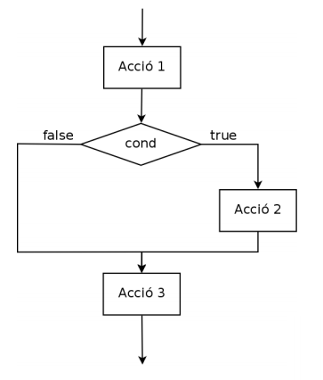
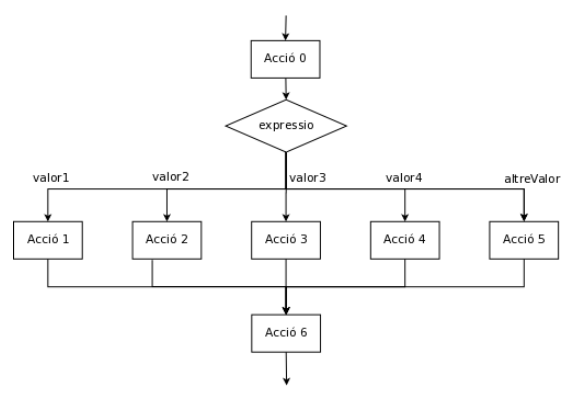

#### Estructura de selecció

{}
 L'estructura de control **condicional o alternativa** permet prendre una decisió en un moment determinat sobre quines instruccions s'han d'executar. Donada una expressió booleana (una expressió lògica que s'avalua a veritat "true" o fals "false") permet decidir entre un o varis camins d'execució. 
{}

Existeixen diferents tipus d'estructura condicional. 
1. Estructura simple (if)
2. Estructura composta (if/else)
3. Estructura encadenada (if/else if/else)
4. Sentència switch (switch)
5. Combinació d'estructures

#### 1. Estructura simple (if)
Aquesta és la forma bàsica. Consisteix en una estructura en la qual si l' avaluació lògica és certa s'executen una sèrie d'instruccions, en cas contrari s'ometen aquestes instruccions. Consideracions:
- L'expressió lògica ha d'anar precedida de la paraula if i entre parèntesi ().
- Les instruccions que s'han d'executar es situen a continuació dins de les claus {}.
- Només s'executarà el bloc d'instruccions contingut entre {} quan l'expressió booleana s'avaluï a cert.

|Codi| Diagrama de flux|
|---|---|
|Acció1;<br>if ( cond ) {<br>&nbsp;&nbsp;&nbsp;&nbsp;Acció2;<br>}<br>Acció3;|| 

```java
//Exemple estructura simple (if)
int nota = sc.nextInt();                                  //Acció1
if( nota == 8){                         
    System.out.println("Tens un notable, nota: " + nota); //Acció2
}
nota = 0;                                                 //Acció3

//Quan es tracta d'una sola instrucció dins el bloc de l'if, com és el cas amb l'Acció2, no ens caldria posar "{ }" Podria quedar de la següent manera:
int nota = sc.nextInt();                                             //Acció1
if( nota == 8) System.out.println("Tens un notable, nota: " + nota); //Acció2
nota = 0;                                                            //Acció3
```

#### 2. Estructura composta (if/else)
La diferència respecte el cas anterior és que ara quan l'expressió booleana s'avaluï a fals també s'executarà un bloc d'instruccions. 
- Aquestes instruccions aniran contingudes dins de parèntesis {} i precedides de la paraula else.

|Codi| Diagrama de flux|
|---|---|
|Acció1;<br>if ( cond ) {<br>&nbsp;&nbsp;&nbsp;&nbsp;Acció2;<br>} else {<br>&nbsp;&nbsp;&nbsp;&nbsp;Acció3;<br>}<br>Acció4;|| 

```java
//Exemple estructura composta (if/else)
int nota = sc.nextInt();                                //Acció1
if( nota >= 5){                         
    System.out.println("Estàs aprovat");                //Acció2
}
else{
    System.out.println("Estàs suspès");                 //Acció3
}
nota = 0;                                               //Acció4

//D'igual manera es podria reescriure com:
int nota = sc.nextInt();                                //Acció1
if( nota >= 5) System.out.println("Estàs aprovat");     //Acció2
else System.out.println("Estàs suspès");                //Acció3
nota = 0;                                               //Acció4
```

##### Estructura ternària

Existeix una estructura similar a l'estructura composta que seria la següent:

```java
int resultat = (cond)? a : b;
```

Equivaldria a:

```java
int resultat;
if (cond){
    resultat = a;
}
else{
    resultat = b;
}
``` 

Un exemple senzill podria ser:

```java
String missatge;
int edat = sc.nextInt();
if (edat >=18){
    missatge = "És major d'edat";
}else{
    missatge = "Encara no és major d'edat";
}
System.out.println(missatge);


//Utilitzant l'operador ternari
var edat = sc.nextInt();
var missatge = (edat >= 18) ? "És major d'edat" : "Encara no és major d'edat";
System.out.println(missatge);
``` 

#### 3. Estructura encadenada o múltiple (if / else if / else)
A vegades es dóna la situació que no volem decidir només entre dos camins d'execució, sinó que el problema ens requereix escollir entre diferents camins, així serà necessari introduir la figura del else if(). Comportament:
- En aquest cas el programa avalua la primera expressió booleana que es troba, si és certa executa el bloc d'instruccions que hi pertany. Però si l'avaluació és falsa anirà a la següent expressió booleana que es trobarà en un bloc else if(). I així consecutivament fins a la última. 
- S'ha de tenir en compte que la prioritat en l'avaluació de les diferents expressions booleanes és important. Si s'avalua a cert en alguna expressió booleana **JA NO** avalua els següents casos, entra dins el bloc d'instruccions, s'executen les instruccions pertinents, i surt de l'estructura de control sense avaluar la resta de casos (podrien avaluar-se també a cert, per això és important la prioritat alhora d'establir els casos). 
- Si s'introdueix un bloc else i cap expressió booleana s'avalua a cert, s'executarà el bloc d'instruccions corresponents a l'else.

|Codi| Diagrama de flux|
|---|---|
|Acció0;<br>if ( cond1 ) {<br>&nbsp;&nbsp;&nbsp;&nbsp;Acció1;<br>} else if (cond2) {<br>&nbsp;&nbsp;&nbsp;&nbsp;Acció2;<br>}else if (cond3) {<br>&nbsp;&nbsp;&nbsp;&nbsp;Acció3;<br>}else if (cond4) {<br>&nbsp;&nbsp;&nbsp;&nbsp;Acció4;<br>}else {<br>&nbsp;&nbsp;&nbsp;&nbsp;Acció5;<br>}<br>Acció6;|| 

```java
//Exemple estructura composta (if/else)
var nota = sc.nextInt();                         //Acció0
if (nota < 5) {                         
    System.out.println("Suspès");                //Acció1
}
else if (nota < 6) {
    System.out.println("Aprovat");               //Acció2
}
else if (nota < 8) {
    System.out.println("Bé");                    //Acció3
}
else if (nota < 9) {
    System.out.println("Notable");               //Acció4
}
else{
    System.out.println("Excel·lent");            //Acció5
}
nota = 0;                                        //Acció6
```


#### 4. Sentència switch (switch)

Aquesta estructura és útil quan en funció del valor d'una variable es poden executar blocs de codi diferents. Per exemple podríem pensar en un menú d'una app on tenim diferents opcions o un comandament a distància de la tele. Consideracions:
- A l'inici d'aquesta estructura comença amb un __switch__ seguida de la variable que volem avaluar entre parèntesi: switch (variable).
- Tot seguit, i entre claus {}, definim tots els casos que es volen tractar d'aquesta variable. Per a cada cas existeix un bloc __case valor:__ amb tots els casos possibles. Per cada **case** el que fa és avaluar si la variable del **switch == valor** definit en el case, si és així executa les instruccions d'aquest case.
- Si volem executar un bloc d'instruccions en cas que no es trobi cap dels valors desitjats per la variable sempre tenim el bloc __default:__ que ens permet fer la mateixa funció que "l'else" en les estructures anteriors.
- En cada bloc case és necessari acabar-lo amb un **break;** si el que volem és sortir de l'estructura per tal que no executi les instruccions del següent case. 
- És una estructura que podríem simular amb una estructura encadenada o múltiple, la única diferència respecte a l'anterior és que en aquest cas, si no posem el break, sí que permetria executar més d'un case diferent.
- Els tipus de dades que poden treballar amb un switch són els següents: byte (Byte), shor (Short), int (Integer), char (Character), enum i String.

|Codi| Diagrama de flux|
|---|---|
|Acció0;<br>switch ( expressio ) {<br>&nbsp;&nbsp;&nbsp;&nbsp;case valor1:<br>&nbsp;&nbsp;&nbsp;&nbsp;&nbsp;&nbsp;&nbsp;&nbsp;Acció1;<br>&nbsp;&nbsp;&nbsp;&nbsp;&nbsp;&nbsp;&nbsp;&nbsp;break;<br>&nbsp;&nbsp;&nbsp;&nbsp;case valor2:<br>&nbsp;&nbsp;&nbsp;&nbsp;&nbsp;&nbsp;&nbsp;&nbsp;Acció2;<br>&nbsp;&nbsp;&nbsp;&nbsp;&nbsp;&nbsp;&nbsp;&nbsp;break;<br>&nbsp;&nbsp;&nbsp;&nbsp;case valor3:<br>&nbsp;&nbsp;&nbsp;&nbsp;&nbsp;&nbsp;&nbsp;&nbsp;Acció3;<br>&nbsp;&nbsp;&nbsp;&nbsp;&nbsp;&nbsp;&nbsp;&nbsp;break;<br>&nbsp;&nbsp;&nbsp;&nbsp;case valor4:<br>&nbsp;&nbsp;&nbsp;&nbsp;&nbsp;&nbsp;&nbsp;&nbsp;Acció4;<br>&nbsp;&nbsp;&nbsp;&nbsp;&nbsp;&nbsp;&nbsp;&nbsp;break;<br>&nbsp;&nbsp;&nbsp;&nbsp;default:<br>&nbsp;&nbsp;&nbsp;&nbsp;&nbsp;&nbsp;&nbsp;&nbsp;Acció5;<br>} <br>Acció6;|| 

```java
var animal = sc.next();
var result;                          //Acció 0
switch (animal) {
    case "DOFI":
        result = "animal marí";         //Acció 1
        break;
    case "VACA":
        result = "animal terrestre";    //Acció 2
        break;
    case "CORB":
        result = "animal aeri";         //Acció 3
        break;
    case "GOS":
        result = "animal terrestre";    //Acció 4
        break;
    case "TAURO":
        result = "animal marí";         //Acció 5
        break;
    default:
        result = "animal desconegut";   //Acció 6
        break;
}
System.out.println(animal + " es un " + result);   //Acció 7
``` 

Podríem entendre aquest codi de la següent manera en l'estructura de if / else if / else:
```java
var animal = sc.next();
var result;  
if (animal.equals("DOFI")) result = "animal marí";
else if(animal.equals("VACA")) result = "animal terrestre";
else if(animal.equals("CORB")) result = "animal aeri";
else if(animal.equals("GOS")) result = "animal terrestre";
else if(animal.equals("TAURO")) result = "animal marí";
else result = "animal desconegut";                     
System.out.println(animal + " es un " + result);  
``` 

Observem que existeixen dos casos d'animal marí i dos d'animal terrestre, així que podríem reduir el codi en:
```java
var animal = sc.next();
var result;  
if (animal.equals("DOFI") OR animal.equals("TAURO")) result = "animal marí";
else if(animal.equals("VACA") OR animal.equals("GOS")) result = "animal terrestre";
else if(animal.equals("CORB")) result = "animal aeri";
else result = "animal desconegut";                     
System.out.println(animal + " es un " + result);  
```

De la mateixa manera fent ús del switch quedaria:
```java
var animal = sc.next();
var result;                             //Acció 0
switch (animal) {
    case "DOFI":
    case "TAURO":
        result = "animal marí";         //Acció 1
        break;
    case "VACA":
    case "GOS":
        result = "animal terrestre";    //Acció 2
        break;
    case "CORB":
        result = "animal aeri";         //Acció 3
        break;
    default:
        result = "animal desconegut";   //Acció 6
        break;
}                   
System.out.println(animal + " es un " + result);  
```

Des de JDK12 s'incorpora els **->** en la formulació del switch, aquesta nova versió li dóna un aire mes legible i més elegant. L'exemple anterior usant els "arrow" en el switch quedaria:

```java
var animal = sc.next();
var resultat = switch (animal) {
    case "DOFI"  -> "animal marí";
    case "VACA"  -> "animal terrestre";
    case "CORB"  -> "animal aeri";
    case "GOS"   -> "animal terrestre";
    case "TAURO" -> "animal marí";
    default      -> "animal desconegut";
};    
System.out.println(animal + " es un " + resultat);  
```

Optant per l'opció de juntar els CASE quedaria encara més resumit:

```java
var animal = sc.next();
var resultat = switch (animal) {
    case "DOFI", "TAURO"  -> "animal marí";
    case "VACA", "GOS"    -> "animal terrestre";
    case "CORB"           -> "animal aeri";
    default               -> "animal desconegut";
};   
System.out.println(animal + " es un " + resultat);  
```

##### Enum

Finalment incorporem un tipus nou, **enum**, que s'ajusta molt bé en el cas d'estructures switch. Enum és una llista de valors constants que pot prendre una variable. Seguint el cas anterior quedaria de la següent manera:

```java
Scanner sc = new Scanner(System.in);
String animalString = sc.next();

enum animals{ DOFI, TAURO, VACA, GOS, CORB};
Animal animal = animals.valueOf(animalString);

var resultat = switch (animal) {
    case DOFI, TAURO  -> "animal marí";
    case VACA, GOS    -> "animal terrestre";
    case CORB         -> "animal aeri";
    default           -> "animal desconegut";
};    
System.out.println(animal + " es un " + resultat);  
```

Finalment per acabar l'exemple, s'observa com mai s'accedeix a default, de fet, si introduïm un element que no està dins del llistat animals **es produeix una excepció** (ho veurem properament). Una excepció és un error inesperat i, en aquest cas, causat per la introducció d'un valor no apte per l'enum que tenim definit. En aquest cas per tal de controlar aquest error el que farem és tractar els casos d'animals que no estan dins l'enum de la següent manera:

```java
Scanner sc = new Scanner(System.in);
String animalString = sc.next();

enum animals{ DOFI, TAURO, VACA, GOS, CORB};

try {
    animals animal = animals.valueOf(animalString);
    var resultat = switch (animal) {
        case DOFI, TAURO  -> "animal marí";
        case VACA, GOS    -> "animal terrestre";
        case CORB         -> "animal aeri";
    };
    System.out.println(animal + " es un " + resultat);
    
}catch (IllegalArgumentException e){
    System.out.println(animalString + " es un animal desconegut");
}
```

Observem com en el tractament de l'excepció ja contemplem el cas default que ja no tenim definit en el switch.

#### 5. Combinació d'estructures
Moltes vegades els problemes que ens trobem a la vida real requereix de la composició de diferents estructures de control, així doncs es podria donar el cas que tinguéssim diferents estructures de control unes dins d'altres de forma jerarquitzada. 

Exemple: En l'època actual de Coronavirus, donat els cribatges de PCRs per detectar casos positius ens interessaria detectar quins són els assimptomàtics. Així doncs m'invento un algorisme que permeti filtrar aquelles persones que ens interessa per realitzar les proves. És necessari que donades unes quantes dades ens digui si cal que faci alguna de les proves o no. 
- Volem analitzar les persones entre 18 i 40 anys, d'aquestes es farà la prova bàsica de PCR, però les noies embarassades no realitzaran aquesta bàsica sinó que faran una prova més avançada. Pel que fa a les persones majors de 40 anys els hi realitzarem una prova avançada de PCR i un test d'esforç físic. Deixem l'exercici perquè el resolgueu vosaltres.

#### Exemples

1. Crea un programa on, un cop introduïts dos nombres per l'usuari, es mostri el resultat de sumar dos nombres sempre que el primer sigui més gran al segon. (exemple estructura simple)

```java  
    var num1 = sc.nextInt();
    var num2 = sc.nextInt();
    if(num1 > num2) {
        System.out.println(num1+num2);
    }
```

2. Crea un programa que permeti dir, donats dos nombres per l'usuari, si són múltiples l'un a l'altre. (exemple estructura composta)

```java  
    System.out.println("Entra el 1r nombre");
    var num1 = sc.nextInt();
    System.out.println("Entra el 2n nombre");
    var num2 = sc.nextInt();

    if(num1%num2 == 0 || num2%num1 == 0){
        System.out.println("Són divisors");
    } else {
        System.out.println("No són divisors");
    }
```

3. Creeu un programa que permeti introduir dos nombres i realitzar una operació sobre la base de l'nombre de codi, 1, 2 o 3 permeti restar, multiplicar o dividir els dos nombres i mostrar el resultat per pantalla.

```java 
    System.out.println("Introdueix el primer operand");
    var num1 = sc.nextInt();
    System.out.println("Introdueix el segon operand");
    var num2 = sc.nextInt();
    System.out.println("Introdueix el codi: 1.restar, 2.multiplicar, 3.dividir");
    var opcio = sc.nextInt();
    if(opcio==1)System.out.println(num1 - num2);
    else if(opcio == 2) System.out.println(num1 * num2);
    else if(opcio == 3) System.out.println(num1 / num2);
    else System.out.println("Opcio no correcta.");
```

```java
    System.out.println("Introdueix el primer operand");
    var operand1 = sc.nextInt();
    System.out.println("Introdueix el segon operand");
    var operand2 = sc.nextInt();
    System.out.println("Introdueix el codi: 1.restar, 2.multiplicar, 3.dividir");
    var codi = sc.nextInt();
    var resultat=0;     
    if(codi==1) {
        resultat = operand1 - operand2;
    }else if(codi==2){
        resultat = operand1 * operand2;
    }else if(codi==3){
        resultat = operand1 / operand2;
    }else{
        System.out.println("Codi erroni");
    }

    if(codi == 1 || codi == 2 || codi == 3)
        System.out.println("El resultat de l'operacio és: "+ resultat);
```

4. El mateix exemple anterior però ara amb un switch.

```java  
    Scanner sc = new Scanner(System.in);
    System.out.println("Introdueix el primer operand");
    var operand1 = sc.nextInt();
    System.out.println("Introdueix el segon operand");
    var operand2 = sc.nextInt();
    System.out.println("Introdueix el codi: 1.restar, 2.multiplicar, 3.dividir");
    var codi = sc.nextInt();
    var resultat=0;
    resultat = switch(codi) {
        case 1 ->  operand1 - operand2;
        case 2 ->  operand1 * operand2;
        case 3 ->  operand1 / operand2;
        default -> throw new IllegalStateException("Unexpected value: " + codi);
    };

    if(codi == 1 || codi == 2 || codi == 3)
        System.out.println("El resultat de l'operacio és: "+ resultat);

    switch(codi) {
        case 1, 2, 3 -> System.out.println("El resultat de l'operacio és: " + resultat);
    }

```

5. Crea un programa que donats 4 números indiqui si els números són iguals i quin d'ells és el menor i major nombre de tots ells. El programa a més haurà de mostrar per pantalla el resultat de restar el major pel menor d'ells i el resultat de multiplicar els altres dos.

```java     
    int num1 = sc.nextInt();
    int num2 = sc.nextInt();
    int num3 = sc.nextInt();
    int num4 = sc.nextInt();

    int max = num1;
    int min = num1;
    int mult;

    /**
    *
    * Són iguals??
    */
    if(num1 == num2 && num1 == num3 && num1 == num4) System.out.println("Són iguals");
    else System.out.println("No són iguals");


    /**
    * PROBLEMA DEL MAJOR MENOR 5 OPCIONS
    *
    */

    //OPCIO 1 força bruta
    if(num2>num1 && num2>num3 && num2>num4)max = num2;
    else if(num3>num1 && num3>num2 && num3>num4) max = num3;
    else if(num4>num1 && num4>num2 && num4>num3) max = num4;

    if(num2<num1 && num2<num3 && num2<num4)min = num2;
    else if(num3<num1 && num3<num2 && num3<num4) min = num3;
    else if(num4<num1 && num4<num2 && num4<num3) min = num4;


    //OPCIO 2 comparem el max amb tots i el min amb tots individualment
    max = num1;
    if(num2>max) max = num2;
    if(num3>max) max = num3;
    if(num4>max) max = num4;

    min = num1;
    if(num2<min) min = num2;
    if(num3<min) min = num3;
    if(num4<min) min = num4;


    //OPCIO 3 a Semifinals comparant!
    int max1,max2, min1,min2;

    if(num1> num2)max1 = num1;
    else max1 = num2;

    if(num3 > num4) max2 = num3;
    else max2=num4;

    if(max1 > max2) max = max1;
    else max=max2;


    if(num1 < num2)min1 = num1;
    else min1 = num2;

    if(num3 < num4) min2 = num3;
    else min2=num4;

    if(min1 > min2) min = min1;
    else min=min2;

    //OPCIO 4 semifinals math.max math.min
    max1 = Math.max(num1,num2);
    max2 = Math.max(num3,num4);
    max = Math.max(max1,max2);

    min1 = Math.min(num1,num2);
    min2 = Math.min(num3,num4);
    min = Math.min(min1,min2);

    //OPCIO 5 math.max i math.min
    max = Math.max (Math.max(num1,num2), Math.max(num3,num4));
    min = Math.min (Math.min(num1,num2), Math.min(num3,num4));
    System.out.println(max-min);


    //Segona part de l'activitat on es realitza la multiplicacio amb els que no són major i menor
    if( (max==num1 && min==num2) || (max==num2 && min==num1))mult=num3 * num4;
    else if( (max==num1 && min==num3) || (max==num3 && min==num1))mult=num2 * num4;
    else if( (max==num1 && min==num4) || (max==num4 && min==num1))mult=num2 * num3;
    else if( (max==num2 && min==num3) || (max==num3 && min==num2))mult=num1 * num4;
    else if( (max==num2 && min==num4) || (max==num4 && min==num2))mult=num1 * num3;
    else if( (max==num3 && min==num4) || (max==num4 && min==num3))mult=num1 * num2;

    //Solució utilitzant Math.mix i Math.max per extreure valors que no siguin ni màxim ni mínim.
    int min3 = Math.min (Math.max(num1,num2), Math.max(num3,num4));
    int max3 = Math.max (Math.min(num1,num2), Math.min(num3,num4));
    int mult2 = min3 * max3;
```