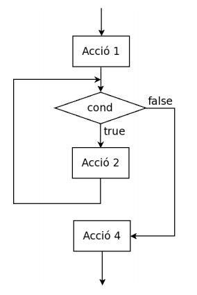
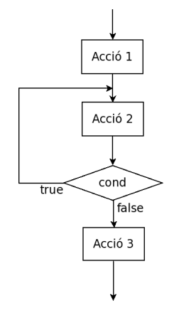

#### Estructura iterativa

{}
 L'estructura de control **iterativa** permet reproduir un bloc d'instruccions un nombre de vegades determinat.<br><br> Mentre es compleixi una expressió booleana (una expressió lògica que s'avalua a veritat "true" o fals "false") permet executar un bloc d'instruccions determinat. <br><br> Anomenarem **bucle** el bloc d'instruccions que es repeteixen i **iteració** a cadascuna de les vegades que es repeteix.
{}

### Característiques generals:
> Tots els bucles tenen:
> - Una *precondició*: Estat abans d'entrar al bucle
> - Una *postcondició*:Estat al sortir de bucle
> - Una *expressió booleana*: mentre es compleixi l'expressió booleana s'itera el bucle, un cop l'expressió booleana s'avalua a fals es "surt" del bucle i es continua amb l'execució de les instruccions següents.
> - *Variable de control*: Ens serveix per controlar el nombre d'iteracions. Aquesta variable pot estar englobada en un dels següents grups:
>      - *acumulador*: guardem en una variable una operació concreta.
>      - *comptador*: augmentem o disminuïm una variable "comptant" iteracions.
>      - *booleana*: pot ser simplement una variable booleana que es manipuli dins el bucle.

{}
 Un bucle necessita:<br>
    1. Una **condició de sortida**: cal que l'expressió booleana s'avaluï a fals per sortir del bucle, sinó provocarem un bucle infinit.<br> 
    2. La **variable de control** ens ha d'acostar pas a pas a complir amb la condició de sortida del bucle.<br>
    3. Dins el bucle acostumen a ver instruccions amb l'objectiu de buscar un **resultat**.
 
{}

Existeixen diferents estructures iteratives. 
1. While
2. For
3. Do while
4. Combinació d'estructures

#### 1. While
L'estructura bàsica d'un bucle while en Java és:

```java
    while(expressió booleana){
        Instruccions del bucle
    }
```

Com ja s'ha explicat, *mentre* s'avaluï l'expressió booleana a cert s'executaran totes les instruccions contingudes en les claus {}. Quan es deixi de complir l'expressió booleana el fil d'execució sortirà del bucle i continuarà amb la següent instrucció que hi hagi després.

Consideracions:
- Si l'expressió no avalua a una expressió booleana donarà un error de compilació.
- Si no s'apliquen mecanismes que modifiquen el comportament de l'expressió booleana aconseguirem un bucle infinit.

|Codi| Diagrama de flux|
|---|---|
|Acció1;<br>while ( cond ) {<br>&nbsp;&nbsp;&nbsp;&nbsp;Acció2;<br>}<br>Acció4;|| 

#### 2. For
El for és una estructura que permet realitzar **recorreguts** a un conjunt de dades de forma simple. Ens permet condensar la funcionalitat de bucle en una sola línia. Per exemple podem recorre els nombres del 1 al 10 de la següent manera:

```java
    for(int i=1; i <= 10; i++){
        System.out.println(i);
    }
```
Com s'observa, dins dels parèntesi "()" tenim tres instruccions separades per ";" :
- Inicialització d'una variable iteradora abans d'entrar al bucle (int i=1).
- Després tenim l'expressió booleana igual com posaríem en un bucle while (i<=10).
- Finalment tenim el pas que ens assegura que el bucle acaba (i++).

Així doncs

*for (inicialització Iterador; Expressió booleana; Modificació Iterador)*


{}
 Qualsevol bucle while es pot transformar en un bucle for i viceversa.
{}
 Així doncs, l'exemple anterior si el transformem en un while queda de la següent manera:

```java
    int i=1;                    //Inicialització variable
    while( i <= 10 ){           //Expressió booleana
        System.out.println(i);  // Resultat
        i++;                    //Modificació instrucció iteradora
    }
```

#### 3. Do while
Aquesta estructura no és gaire utilitzada i és similar a l'estructura while. La diferència és que en el *while* abans de realitzar cap iteració es comprova l'expressió booleana, en canvi amb el *do while* primer es realitzar una iteracio i després es comprova l'expressió booleana. A efectes pràctics si estem segurs que existeix almenys una iteració es pot usar aquesta estructura. 

El cas anterior fet en *do while* seria:

```java
    int i=1;                    //Inicialització variable
    do                    
    {           
        System.out.println(i);  // Resultat
        i++;                    //Modificació instrucció iteradora
    }while( i <= 10 );          //Expressió booleana
```

|Codi| Diagrama de flux|
|---|---|
|Acció1;<br>do {<br>&nbsp;&nbsp;&nbsp;&nbsp;Acció2;<br>} while ( cond );<br>Acció3;|| 


#### 4. Combinació d'estructures
Moltes vegades els nostres programes requereixen de més d'un bucle encadenat, per exemple quan resseguim una matriu de dades. Imagineu-vos un programa que escanegi un tauler d'escacs, no només ha de llegir files, sinó que també ha de llegir columnes, així doncs l'estructura seria la següent:

```java
    for(int i=1; i <= 8; i++){
        for(int j=1; j <= 8; j++){
            System.out.println("Posició " + i + " " + j);
        }
    }
```

En l'exemple anterior per cada posició ièssima es recorre el bucle 8 vegades per cada j. Així per cada fila recorrem totes les columnes. Si mirem l'execució del bucle obtenim:

```
Posició 1 1
Posició 1 2
Posició 1 3
Posició 1 4
Posició 1 5
Posició 1 6
Posició 1 7
Posició 1 8
Posició 2 1
Posició 2 2
Posició 2 3
Posició 2 4
Posició 2 5
Posició 2 6
Posició 2 7
Posició 2 8
Posició 3 1
Posició 3 2
Posició 3 3

...

Posició 8 8

```

En aquest cas estem parlant de dos bucles que són **independents** entre ells. Ja que per cada bucle interior no té afectació en l'exterior.

Però a vegades és necessari que els bucles siguin **dependents**, en aquest cas sí que hi hauria afectació. Modifiquem el programa anterior perquè per exemple enlloc de mostrar tot el tauler de posicions només vull mostrar aquelles que es troben per sobre de la diagonal:

```java
    for(int i=1; i <= 8; i++){
        for(int j=1; j <= 8; j++){
            if(i < j) {
                System.out.println("Posició " + i + " " + j);
            }
        }
    }
```
En aquest cas, si executeu veureu que només mostra la meitat superior de posicions. Això és així perquè en el bucle interior realitzem una operació que DEPÈN de la variable **i** que pertany al primer bucle, per tant el bucle interior depèn de l'exterior.


 


#### Exemples

1. Fer un programa que llegeixi dos nombre enters n 1 i n 2 amb n 1 < n 2 i escrigui tots els nombres enters dins l’interval [n 1 , n 2 ] en ordre creixent. Aquest és un exemple de recorregut on la variable n1 fa de **comptador**.

```java  
    int n1 = sc.nextInt();
    int n2 = sc.nextInt();
    while(n1<=n2) {
        System.out.println(n1);
        n1++;
    }
```

2. Fer un programa que llegeixi dos nombre enters n 1 i n 2 amb n 1 < n 2 i escrigui els nombres enters parells que hi ha dins l’interval [n 1 , n 2 ] en ordre creixent. El nombre zero es considera parell.

```java  
    int n1 = sc.nextInt();
    int n2 = sc.nextInt();

    for(int i=n1; i <= n2; i++) {
        if(i%2==0)System.out.println(i);
    }

    //2naOpcio (meitat d'iteracions)
    if(n1%2!=0)n1++;
    while(n1<=n2) {
        System.out.println(n1);
        n1 = n1+2;
    }
```

3. Fer un programa que llegeixi el valor de la base, un nombre enter i l’exponent, un nombre enter no negatiu, i escrigui el valor de la potència a b . No emprar la funció Math.pow(). En aquest cas resultat fa d' **acumulador** d'un resultat que es mostra al final.
        
```java
    int base = sc.nextInt();
    int exponent = sc.nextInt();
    int i = 0;
    int resultat = 1;
    while(i < exponent) {
        resultat = resultat * base;
        i++;
    }
    System.out.println(resultat);
```

4. Fer un programa que llegeixi un nombre enter i escrigui si és un nombre primer o no. Un nombre enter és primer si es més gran que 1 i només és divisible per 1 i per ell mateix. 


```java  

/*
Fixeu-vos amb l'expressió booleana del bucle, en aquest cas es fa ús d'una variable booleana per sortir del bucle i no continuar iterant, en cas que ja haguem descobert la solució i no sigui necessari continuar iterant.
*/

System.out.println("Llegeix nombre: ");
int n = sc.nextInt();

//inicialitzo variables,index=n/2 i analitzem tots els possibles divisors de n/2 fins a 1.
boolean esPrimer = true;
int index = n/2;

//En la condició del bucle,si trobem un divisor ja no cal que continuem buscant i acabem
while(index > 1 && esPrimer){
    if(n % index == 0) esPrimer=false;
    index--;
}

//Escrivim solucio
String sol = (!esPrimer)? "NO és primer" : "És primer" ;
System.out.println(sol);
```

5. Fer un programa que llegeixi un nombre enter i escrigui si és capicua o no.Considerarem també capicues els nombres enters d'una xifra.

```java     
    System.out.println("Llegeix nombre: ");
    int n = sc.nextInt();
    int valorInicial = n;
    int capicua = 0;
    while(n>0){
        capicua = capicua*10;
        capicua = capicua + n%10;
        System.out.println(capicua);
        n = n/10;
    }
    System.out.println(capicua);

    if(valorInicial == capicua) System.out.println(n+ "és un nombre capicua");
```