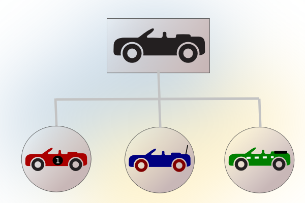
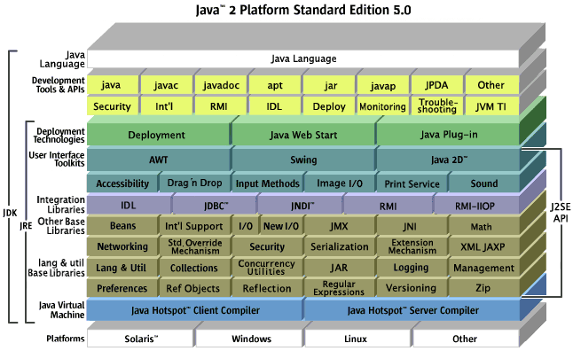

#### Definicions

| | |
|---|---|
|Classe     |**Una classe és la definició d'un objecte real.**  És l'element que descriu els components d'un objecte de manera general. En ell hi queden especificats quines característiques té l'objecte (atributs) i quines accions pot realitzar (mètodes). És la plantilla que ens servirà per crear objectes.|
|Objecte    |**Un objecte és una instància d'una classe.**   Diem que hem creat o instanciat un objecte quan donem valors i fem servir els components definits a la classe.|
|Atribut   |**Un atribut és una característica concreta d'un objecte.**   Es defineix com les variables del programes estructurats, és a dir, definint tipus de dades i nom.|
|Mètode   |**Els mètodes defineixen quines funcionalitats o accions pot realitzar la classe.**   Reflecteixen les operacions que es poden fer sobre els atributs. |

#### Exemple

Un exemple podria ser una classe jugadorFutbol que tingués:

- *atributs:* nom, edat, pes, posició, nacionalitat, etc. 
- *mètodes:* marcaGols, esLesiona, protestaArbitre, canviaPosicio, etc.

I amb aquesta classe jugadorFutbol definida podríem tenir diferents jugadors, per tant hi instanciaríem diferents objectes:

- Leo Messi, 33 anys, 65kg, davanter, argentí.
- Andres Iniesta, 36 anys, 67kg, centrecampista, espanyol.

### Característiques generals de POO

##### Abstracció

{}
Es tracta de centrar-se en **“el què fa”** més que no en el **“com ho fa”**.
{}

Com hem vist en l'exemple anterior, sabem que dos objectes diferents com el Joan i la Maria tenen unes característiques i un comportament comú, d'aquí hem deduït per abstracció que formen part del mateix conjunt Persones. Així doncs l'abstracció ens permet aïllar aquella part que ens interessa del conjunt. Ex:
- No és necessari saber de mecànica de bicicletes per aprendre a anar en bicicleta.
- No és necessari conèixer què fan exactament les funcions del kernel de linux per usar-les.
- No ens cal conèixer en profunditat com funciona el rentaplats per usar-lo.
Tots els exemples anteriors són casos en els que fem ús d'un instrument sense coneixer-lo a fons.

De fet, ja hem fet ús de l'abstracció en la UF2. Les accions i funcions que heu creat encapsulen línies de codi, quan fem crides a aquestes funcions s'executen una sèrie d'instruccions definides dins aquests blocs. De la mateixa manera quan definiu els mòduls/classes podeu crear funcions privades que utilitzeu pel funcionament del vostre programa però que NO seran accessibles des del programa principal.

Igual com ja hem vist en la UF2, l'abstracció permet que qualsevol objecte el poguem **reutilitzar** en qualsevol situació. Per exemple, l'objecte cotxe vist anteriorment el podem fer servir en una aplicació de carreres però també per a una
altra de mobilitat sostenible. El que tenen en comú és que identifiquem el mateix objecte en ambdues aplicacions(característiques i comportament).

#### Encapsulament

{}
Es refereix a l'ocultació d'informació de forma que les dades internes d'un objecte són ocultes al món exterior, tal sols sabem què podem fer amb ell.
{}
 
Per exemple, quan escrivim per pantalla amb el mètode “sc.nextInt()”, sols sabem que ens retorna un enter però no sabem com és la implementació d'aquest mètode per dins, ni tampoc coneixem les seves variables internes.

#### Modularitat

{}
es refereix a la forma en que els elements es POO es troben organitzats en mòduls (paquets en Java) facilitant l'encapsulació i abstracció de la informació.
{}

#### Jerarquia

{}
S'ordenen els objectes de forma que s'estableixen relacions entre ells. Serveix per especificar aquelles característiques d'un objecte necessàries per la nostra aplicació.
{}

La jerarquia s'estableix mitjançant herència. Per exemple, podem definir objectes vehicle (amb matrícula, cavalls, etc..) i també objectes camions que hereten les característiques de vehicle i n'afegeixen d'altres (pes màxim, etc...).

#### Polimorfisme

{}
Defineix la possibilitat de tenir mètodes iguals però amb implementacions diferents segons de l'objecte que la faci servir.
{}

Un bon exemple de polimorfisme és l'operador +. Si l'apliquem a dos enters ens retorna la suma d'aquests, mentre que si l'apliquem a dos strings ens els concatena, per tant, donat el mateix operador, el comportament és diferent, és un element sobrecarregat i que adopta diferent funció depenent dels tipus que el rodegen. En POO passa el mateix, podem tenir un mètode que faci una funció diferent depenent de quin objecte l'implementa. 

