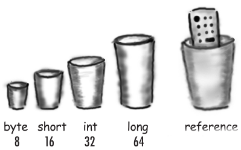
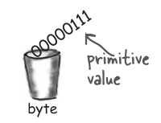
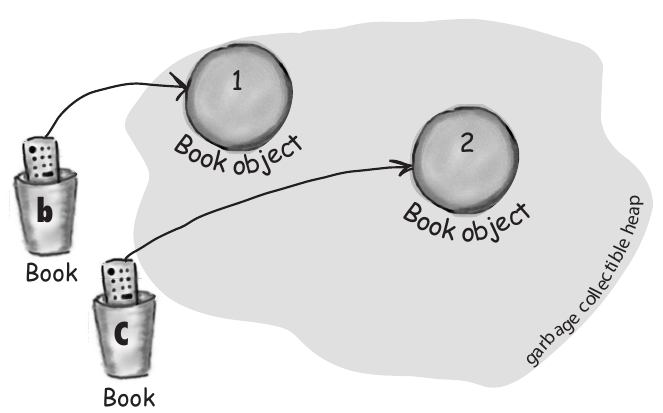
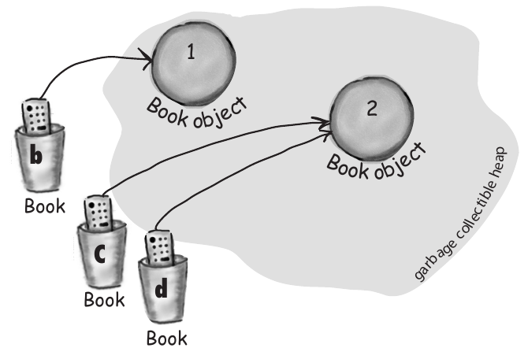
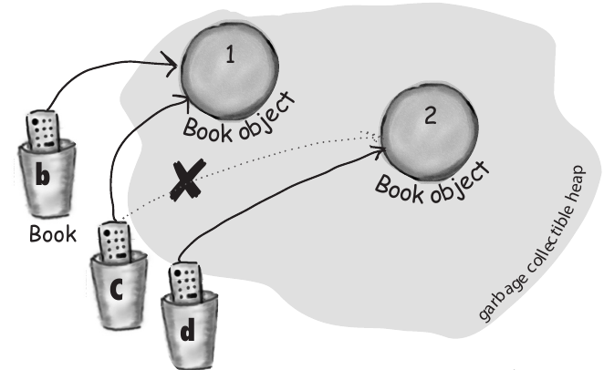
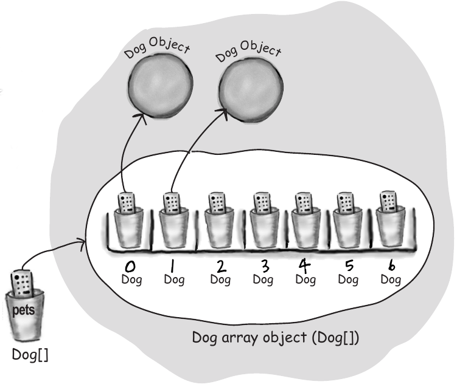
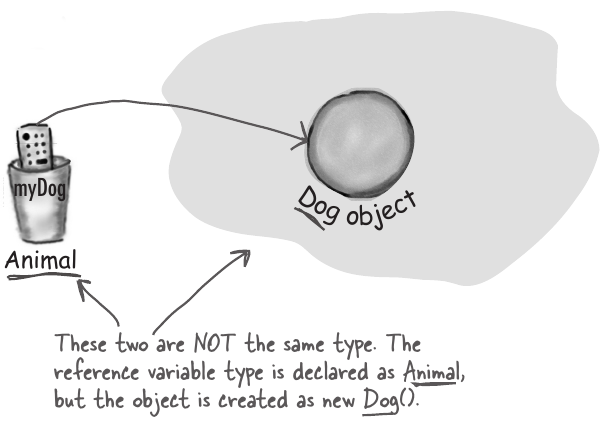
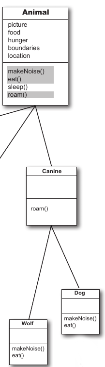

## Declaració de referències i creació d'objectes

Abans de res, fem un repàs de com declarem variables i creem objectes.

Quan fem una declaració del tipus `Dog myDog = new Dog();` ja hem vist que la variable myDog no conté un objecte Dog, si no una referència de tipus Dog. Podem pensar en aquesta referència myDog, com un comandament a distància que controla el nostre objecte Dog. Aquest comandament conté la interficie o api del objecte Dog, és a dir, la part pública amb la que els usuaris d'aquesta classe poden interactuar.

<div style="display: flex;gap:30px;justify-content: center;align-items: center;">


</div>

<p>Podem desglossar aquesta expressió en tres parts:</p>

```java
Dog myDog = new Dog();
   (1)   (2)   (3)
```

| <b>1. Declara una variable referència:</b> <span style="background-color:LightGray">Dog myDog</span> = new Dog()                                                                                                               |
| ------------------------------------------------------------------------------------------------------------------------------------------------------------------------------------------------------------------------------ |
| Indica a la JVM que assigni espai per a una variable de referència (al Stack). La variable referència serà del tipus Dog. És a dir, un comandament a distància que té botons per controlar un gos, però no un gat, ni un llop. |

<br>

| <b>2. Crea un objecte:</b> Dog myDog = <span style="background-color:LightGray">new Dog()</span> |
| ------------------------------------------------------------------------------------------------ |
| Indica a la JVM que assigni espai per a un nou objecte Dog al Heap.                              |

<br>

| <b>3. Enllaça l'objecte amb la referència</b> Dog myDog <span style="background-color:LightGray"> = </span> new Dog() |
| --------------------------------------------------------------------------------------------------------------------- |
| Assigna un nou gos a la variable de referència myDog.                                                                 |

Vegem alguns exemples;

```java
Book b = new Book();
Book c = new Book();
Book d = c;
c = b;
pets = new Dog[7];
```

<div style="display:flex;gap:20px;justify-content:left;align-items: center;">
<div></div>
<div></div>
<div></div>
<div></div>
</div>

## Polimorfisme

Fins ara, el tipus de la referència i el tipus del objecte són el mateix, és a dir, a l'expressió `Dog dog = new Dog()` tenim una variable referència de tipus Dog que fa referència a un objecte de tipus Dog. Amb el polimorfisme, el tipus de la referència i el tipus del objecte poden ser diferents. Podem fer que el tipus de la referència sigui una superclasse del tipus del objecte. Per exemple, podem fer coses com:

```java
Animal myDog = new Dog();
```

<div style="display:flex;gap:20px;justify-content:center;align-items: center;">
<div></div>
<div></div>
<div></div>
</div>

Això ens permet crear arrays (i altres estructures de dades) polimòrfiques:

```java
Animal[] animals = new Animal[5];

animals[0] = new Dog();
animals[1] = new Cat();
animals[2] = new Wolf();
animals[3] = new Hippo();
animals[4] = new Lion();

for (Animal animal: animals) {
   animal.eat();
   animal.roam();
}
```

A més, podem tenir funcions o mètodes amb arguments i retorns de tipus polimòrfics:

```java
class Vet {
   public void vaccinates(Animal a) {
      shot(a);
      a.makeNoise();
   }
}

Vet vet = new Vet();
Animal dog = new Dog();
Animal cat = new Cat();

vet.vaccinates(dog);
vet.vaccinates(cat);

```

Altres formes de polimorfisme:

- **Method overloading**: és un tipus de polimorfisme en temps de compilació (compile-time polymorphism). També s'anomena polimorfisme _ad hoc_, static o early binding.
- **Method overriding**: es dona en temps d'execució. També s'anomena dinàmic o late binding.

La sobreescriptura ens permet modificar mètodes definits en la superclasse. Per tant ens permet canviar el comportament de mètodes que ja estan definits en la classe pare.

```java
public class Persona {
    public void saluda(){
        System.out.println("Hola soc una persona");
    }
}
public class Alumne extends Persona {
    public void saluda(){
        System.out.println(super.saluda() + " i també sóc un alumne");
    }
}
```

Els mètodes toString, equals, són exemples de mètodes que sobreescrivim amb la idea de que adoptin un comportament diferent a com estan definits en java.lang.Object.

Per exemple ens podríem trobar la sobrecàrrega en els constructors (poder construir un mateix objecte a partir de passar-li paràmetres diferents)

```java
public Persona (){
    this.nom = "desconegut";
    this.edat = -1;
}
public Persona (String nom){
    this.nom = nom;
    this.edat = -1;
}

public Persona (String nom, int edat){
    this.nom = nom;
    this.edat = edat;
}
```

#### Polimorfisme paramètric

{}
**Polimorfisme paramètric.** Aquest tipus de polimorfisme permet crear mètodes i classes que poden funcionar amb diferents tipus de dades, especificats en el moment de l'execució o de la compilació. En Java, això sovint es fa mitjançant l'ús de generics (generics).
{}

```java
class Caixa<T> {
    private T contingut;

    public void establirContingut(T contingut) {
        this.contingut = contingut;
    }

    public T obtenirContingut() {
        return contingut;
    }
}

public class ProvaGenerics {
    public static void main(String[] args) {
        Caixa<String> caixaString = new Caixa<>();
        caixaString.establirContingut("Hola");

        Caixa<Integer> caixaEnter = new Caixa<>();
        caixaEnter.establirContingut(123);

        System.out.println(caixaString.obtenirContingut()); // Mostra "Hola"
        System.out.println(caixaEnter.obtenirContingut()); // Mostra "123"
    }
}

```

## Exemple:

Vegem algunes aplicacions en aquest exemple, on implementem un model de dades senzill per una empresa. Consta de diverses
classes relacionades, i finalment una classe de utilitats on podem veure algunes
aplicacions de polimorfisme

**Worker**

```java
package company;

import java.util.Objects;

public abstract class Worker {
    private final int id;
    private String name;
    private String email;
    private float salary;

    public Worker(int id, String name, String email, float salary) {
        this.id = id;
        this.name = name;
        this.email = email;
        validateSalary(salary);
        this.salary = salary;
    }

    public int getId() {
        return id;
    }

    public String getName() {
        return name;
    }

    public String getEmail() {
        return email;
    }

    public float getSalary() {
        return salary;
    }

    public abstract String getRole();

    private void validateSalary(float salary) {
        if (salary < 0) {
            throw new IllegalArgumentException("Salary cannot be negative");
        }
    }

    @Override
    public boolean equals(Object o) {
        if (o == null || getClass() != o.getClass()) return false;

        Worker worker = (Worker) o;
        return id == worker.id && Float.compare(salary, worker.salary) == 0 && name.equals(worker.name) && Objects.equals(email, worker.email);
    }

    @Override
    public int hashCode() {
        int result = id;
        result = 31 * result + name.hashCode();
        result = 31 * result + Objects.hashCode(email);
        result = 31 * result + Float.hashCode(salary);
        return result;
    }

    @Override
    public String toString() {
        return "Worker{" +
                "id=" + id +
                ", name='" + name + '\'' +
                ", email='" + email + '\'' +
                ", salary=" + salary +
                '}';
    }
}

```

**Manager**

```java
package company;

import java.util.ArrayList;
import java.util.List;

public class Manager extends Worker{
    private List<Worker> subordinates;


    public Manager(int id, String name, String email, float salary) {
        super(id, name, email, salary);
        subordinates = new ArrayList<>();
    }
    public List<Worker> getSubordinates() {
        return subordinates;
    }

    public void addSubordinate(Worker worker) {
        subordinates.add(worker);
    }


    @Override
    public String getRole() {
        return "Manager";
    }

    @Override
    public String toString() {
        return "Manager{" +
                "subordinates=" + subordinates +
                "} " + super.toString();
    }
}
```

**Engineer**

```java
package company;

public class Engineer extends  Worker {

    public enum Specialization {
        SOFTWARE_ENGINEER,
        SOFTWARE_ARCHITECTURE,
        DATA_ENGINEER,
        AI_ENGINEER,
        FRONTEND_ENGINEER,
    }

    private Specialization specialization;


    public Engineer(int id, String name, String email, float salary, Specialization specialization) {
        super(id, name, email, salary);
        this.specialization = specialization;
    }

    public Specialization getSpecialization() {
        return specialization;
    }

    @Override
    public String getRole() {
        return "Engineer";
    }

    @Override
    public String toString() {
        return "Engineer{" +
                "specialization=" + specialization +
                "} " + super.toString();
    }
}
```

**Intern**

```java
package company;

public class Intern extends Worker {
    private final int durationInWeeks;

    public Intern(int id, String name, String email, float salary, int durationInWeeks) {
        super(id, name, email, salary);
        this.durationInWeeks = durationInWeeks;
    }

    public int getDurationInWeeks() {
        return durationInWeeks;
    }

    @Override
    public String getRole() {
        return "Intern";
    }

    @Override
    public String toString() {
        return "Intern{" +
                "durationInWeeks=" + durationInWeeks +
                "} " + super.toString();
    }
}
```

**CompanyUtilities**

```java
package company;

import java.util.List;

public class CompanyUtilities {

    public static void printWorkerDetails(Worker worker) {
        System.out.println("----------------------");
        System.out.println("Worker Details:");
        System.out.println("----------------------");
        System.out.println("Name: " + worker.getName());
        System.out.println("Role: " + worker.getRole());
        if (worker instanceof Manager manager) {
            System.out.println("Subordinates: " + manager.getSubordinates().size());
        } else if (worker instanceof Engineer engineer) {
            System.out.println("Specialization: " + engineer.getSpecialization());
        } else if (worker instanceof Intern intern) {
            System.out.println("Internship Duration: " + intern.getDurationInWeeks() + " months");
        }
    }

    public static void sortBySalary(List<Worker> workers, boolean reverse) {
        final int r = reverse ? -1 : 1;
        workers.sort((w1, w2) -> r * Float.compare(w1.getSalary(), w2.getSalary()));
    }

    public static void sortBySalary(List<Worker> workers) {
        sortBySalary(workers, false);
    }

    public static void sortByName(List<Worker> workers) {
        workers.sort((w1, w2) -> w1.getName().compareTo(w2.getName()));
    }

    public static float calculateTotalSalary(List<Worker> workers) {
        float total = 0;
        for (Worker worker : workers) {
            total += worker.getSalary();
        }
        return total;
    }
}
```

**TestCompany**

```java
package company;

import java.util.ArrayList;
import java.util.Collections;
import java.util.List;

import static company.CompanyUtilities.*;

public class TestCompany {

    public static void main(String[] args) {
        Manager manager = new Manager(1, "Alice", "alice@company.com", 90000);
        Engineer engineer = new Engineer(2, "Bob", "bob@company.com", 70000, Engineer.Specialization.DATA_ENGINEER);
        Intern intern = new Intern(3, "Charlie", "charlie@company.com", 15000, 6);

        manager.addSubordinate(engineer);
        manager.addSubordinate(intern);

        List<Worker> workers = new ArrayList<>();
        workers.add(manager);
        workers.add(engineer);
        workers.add(intern);

        printWorkerDetails(manager);
        printWorkerDetails(engineer);
        printWorkerDetails(intern);

        System.out.println("#######");
        sortBySalary(workers, true);
        workers.forEach(worker -> System.out.println(worker.getRole() + ": " + worker.getSalary()));

        sortByName(workers);
        workers.forEach(worker -> System.out.println(worker.getRole() + ": " + worker.getName()));
        System.out.println("#######");

        System.out.println(calculateTotalSalary(workers));


    }
}
```
