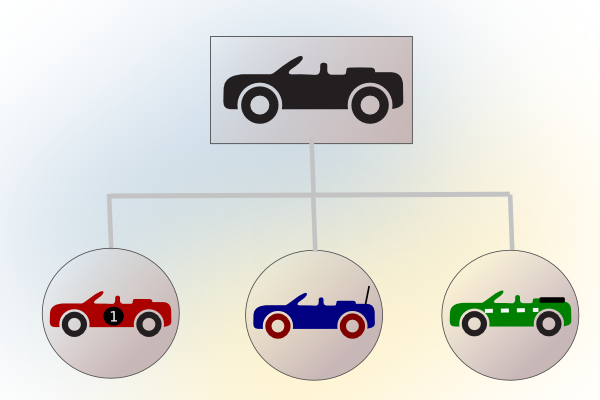

Com hem observat, a mesura que tenim problemes més complexes és necessari fer ús de tècniques que ens ajudin a programar d'una forma més senzilla, d'aquesta manera hem passat de la programació estructurada a la programació modular. Continuant en aquest procés ara toca fer el salt per conèixer la programació orientada a objectes (POO). Com ja hem vist dins el món de la programació hi ha una sèrie de paradigmes que repassem tot seguit.

{}
Un **paradigma** és una forma de representar i manipular el coneixement. Representa un enfocament particular o filosofia per a la construcció del programari. 
{}

En l'apartat d' [Estructura d'un programa -> Tipus de llenguatges]({}) s'aprofundeix en els diferents paradigmes de programació.

#### 1. Paradigma de Programació orientada a objectes

{}
Es fonamenta en la manera en que els éssers humans percebem i entenem els objectes del nostre món
{}

__Exemple:__

Joan

Maria

Que tenen en comú el Joan i la Maria? **Els dos són persones**. 

Mitjançant un procés de generalització sabem que els dos __objectes__ Joan i Maria pertanyen a la mateixa __classe__ persona.

Mitjançant aquesta **abstracció** identifiquem molts *exemples* de la mateixa *plantilla*. Així doncs sabem que tots aquests exemples tenen les característiques comunes d'una plantilla persona.

Aprofundim ara en els nostres exemples de Persona: Joan i Maria.

|||
|---|---|
|| *Atributs* - Nom - Estatura - Pes - Color cabell - Color ulls - Edat - Sexe - Té un nas *Mètodes* - Somriu - Parla - Dorm - Pensa - Menja|
|| *Atributs* - Nom - Estatura - Pes - Color cabell - Color ulls - Edat - Sexe - Té un nas *Mètodes* - Somriu - Parla - Dorm - Pensa - Menja|

Com podem observar tant en Joan com la Maria tenen una sèrie de *característiques comunes* (atributs) i un *comportament comú* (mètodes) ja que els dos es poden classificar dins la mateixa categoria de persones.

La POO consisteix en fer servir aquesta manera natural de pensar en objectes com a mecanisme per a organitzar millor el nostre codi i poder desenvolupar, mantenir i ampliar aplicacions de software amb un alt grau de complexitat.

### Característiques generals de POO

##### Abstracció

{}
Es tracta de centrar-se en **“el què fa”** més que no en el **“com ho fa”**.
{}

Com hem vist en l'exemple anterior, sabem que dos objectes diferents com el Joan i la Maria tenen unes característiques i un comportament comú, d'aquí hem deduït per abstracció que formen part del mateix conjunt Persones. Així doncs l'abstracció ens permet aïllar aquella part que ens interessa del conjunt. Ex:
- No és necessari saber de mecànica de bicicletes per aprendre a anar en bicicleta.
- No és necessari conèixer què fan exactament les funcions del kernel de linux per usar-les.
- No ens cal conèixer en profunditat com funciona el rentaplats per usar-lo.
Tots els exemples anteriors són casos en els que fem ús d'un instrument sense coneixer-lo a fons.

De fet, ja hem fet ús de l'abstracció en la UF2. Les accions i funcions que heu creat encapsulen línies de codi, quan fem crides a aquestes funcions s'executen una sèrie d'instruccions definides dins aquests blocs. De la mateixa manera quan definiu els mòduls/classes podeu crear funcions privades que utilitzeu pel funcionament del vostre programa però que NO seran accessibles des del programa principal.

Igual com ja hem vist en la UF2, l'abstracció permet que qualsevol objecte el poguem **reutilitzar** en qualsevol situació. Per exemple, l'objecte cotxe vist anteriorment el podem fer servir en una aplicació de carreres però també per a una
altra de mobilitat sostenible. El que tenen en comú és que identifiquem el mateix objecte en ambdues aplicacions(característiques i comportament).

#### Encapsulament

{}
Es refereix a l'ocultació d'informació de forma que les dades internes d'un objecte són ocultes al món exterior, tal sols sabem què podem fer amb ell.
{}
 
Per exemple, quan escrivim per pantalla amb el mètode “sc.nextInt()”, sols sabem que ens retorna un enter però no sabem com és la implementació d'aquest mètode per dins, ni tampoc coneixem les seves variables internes.

#### Modularitat

{}
es refereix a la forma en que els elements es POO es troben organitzats en mòduls (paquets en Java) facilitant l'encapsulació i abstracció de la informació.
{}

#### Jerarquia

{}
S'ordenen els objectes de forma que s'estableixen relacions entre ells. Serveix per especificar aquelles característiques d'un objecte necessàries per la nostra aplicació.
{}

La jerarquia s'estableix mitjançant herència. Per exemple, podem definir objectes vehicle (amb matrícula, cavalls, etc..) i també objectes camions que hereten les característiques de vehicle i n'afegeixen d'altres (pes màxim, etc...).

#### Polimorfisme

{}
Defineix la possibilitat de tenir mètodes iguals però amb implementacions diferents segons de l'objecte que la faci servir.
{}

Un bon exemple de polimorfisme és l'operador +. Si l'apliquem a dos enters ens retorna la suma d'aquests, mentre que si l'apliquem a dos strings ens els concatena, per tant, donat el mateix operador, el comportament és diferent, és un element sobrecarregat i que adopta diferent funció depenent dels tipus que el rodegen. En POO passa el mateix, podem tenir un mètode que faci una funció diferent depenent de quin objecte l'implementa. 

